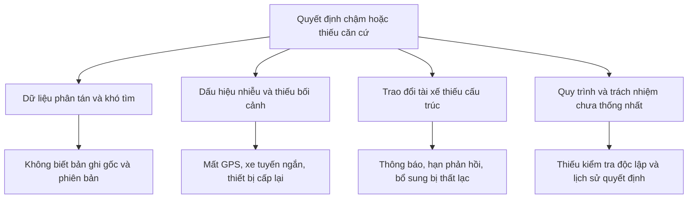

# Bối cảnh, vấn đề và mục tiêu kinh doanh

## Bài toán cần giải quyết

Doanh nghiệp cần xác định **nghi vấn nào đáng điều tra, căn cứ nào đủ tin cậy, tài xế có cách giải thích nào hợp lệ, ai được kết luận và quyết định được kiểm tra lại như thế nào**. Phát hiện bất thường chỉ là đầu vào. Giá trị của sản phẩm nằm ở khả năng chuyển các dấu hiệu rời rạc thành hồ sơ có thể kiểm chứng, xử lý nhất quán và phối hợp được giữa hai bên.

Định nghĩa làm việc: gian lận là hành vi cố ý làm sai lệch giao dịch, danh tính hoặc điều kiện hưởng lợi nhằm đạt lợi ích không hợp lệ theo quy chế đã được ban hành. Sai dữ liệu, sự cố kỹ thuật, vi phạm chất lượng dịch vụ và gian lận phải có nhãn riêng. Hệ thống không tự chứng minh yếu tố cố ý từ một điểm GPS hoặc một điểm số.

Phạm vi nghiệp vụ giả định là chuyến vận tải hành khách có tài xế, mã chuyến, GPS, thiết bị và chính sách thưởng. Tên repository gợi ý bối cảnh VFS/GSM nhưng không đủ để khẳng định quy chế, quy mô, tổ chức hoặc hệ thống thực tế của các doanh nghiệp này.

## Những gì đã biết và chưa biết

| Loại thông tin | Nội dung | Hệ quả |
| --- | --- | --- |
| Đã quan sát trong [repository](../../README.md) | Có prototype bốn nhóm quy tắc, dữ liệu tổng hợp, hồ sơ và truy nguyên nguồn | Có thể tái sử dụng để minh họa discovery |
| Đã quan sát | Luồng giải trình hiện chỉ còn lịch sử; chưa có xác thực/phân quyền | Phối hợp tài xế là khoảng trống sản phẩm quan trọng |
| Chưa biết | Tỷ lệ gian lận, tiền tổn thất, tải kiểm soát, hệ thống nguồn, trải nghiệm tài xế | Không đưa số liệu hiệu quả thực tế hoặc ROI đã đạt |
| Tham chiếu công khai | Uber mô tả việc đưa bất thường cho người kiểm tra và giải thích lý do cảnh báo | Cơ sở tham khảo cho luồng điều tra; không chứng minh hiệu quả tại đơn vị này. [Nguồn](https://www.uber.com/us/en/blog/risk-entity-watch/) |

## Cây vấn đề để kiểm chứng

Đây là cây giả thuyết, không phải kết quả khảo sát. Kiểm chứng bằng quan sát xử lý hồ sơ thật đã được phép truy cập, đo thời gian từng bước và đối chiếu hồ sơ bị đảo kết luận. Cần tìm cả nguyên nhân từ chính sách thưởng và hệ thống nguồn; không mặc định mọi thất thoát đều do tài xế.

## Mục tiêu và phép đo

Tất cả mục tiêu dưới đây là **mức đề xuất cho pilot**, chưa có baseline. Đo baseline trong 2–4 tuần hoặc đủ một chu kỳ thưởng; so sánh nhóm vụ việc có cùng loại, khu vực, độ phức tạp và thời gian hoạt động. Dashboard luôn hiển thị số mẫu và khoảng thời gian.

| Mã | Mục tiêu | Công thức và nguồn đo | Mức đề xuất / chủ sở hữu |
| --- | --- | --- | --- |
| OBJ-01 | Tìm căn cứ nhanh hơn | Trung vị và p90 phút thao tác từ mở hồ sơ đến lưu gói bằng chứng; nhật ký phiên làm việc, loại thời gian chờ tài xế | Giảm trung vị ≥30% so baseline; trưởng kiểm soát |
| OBJ-02 | Kết luận có thể kiểm chứng | Hồ sơ đã kết luận có đủ checklist nguồn, phản bác, lý do, người duyệt / tổng hồ sơ đã kết luận | 100%; QA nghiệp vụ |
| OBJ-03 | Giảm nhiễu trong hàng ưu tiên | Precision = TP/(TP+FP) trên mẫu đã được đánh giá độc lập và đã kết thúc cửa sổ khiếu nại | Cải thiện so baseline với cùng năng lực kiểm tra; chưa chốt ngưỡng tuyệt đối; Risk Lead |
| OBJ-04 | Tài xế tham gia hiệu quả | Hồ sơ có phản hồi hợp lệ trong hạn / hồ sơ có yêu cầu đã giao và đã hết hạn; kèm tỷ lệ giao thông báo, thời gian điền biểu mẫu | Đạt ≥80% trong pilot có hỗ trợ; vận hành tài xế |
| OBJ-05 | Giữ tiến độ xử lý | Hồ sơ đạt từng SLA / hồ sơ đã đến hạn tương ứng, gồm cả hồ sơ đang mở quá hạn | ≥90%; trưởng kiểm soát |
| OBJ-06 | Tạo lợi ích kinh tế ròng | Tiết kiệm công xử lý + lợi ích tổn thất được Finance xác nhận − chi phí tăng thêm; không cộng trùng thu hồi và ngăn chặn cùng khoản | Dương trong kịch bản cơ sở được xác minh trước mở rộng; Finance |

TP là trường hợp gian lận được xác nhận qua quy trình đánh giá; FP là cảnh báo được xác nhận không phải gian lận. `inconclusive` và đang khiếu nại không được ép thành FP hoặc TP; công bố tỷ lệ bị loại riêng để tránh làm đẹp precision. Recall chỉ ước lượng khi có lấy mẫu độc lập cả giao dịch không bị cảnh báo. Không dùng độ chính xác trên dữ liệu tổng hợp làm baseline sản xuất.

Chỉ số bảo vệ đi kèm: tỷ lệ đảo kết luận trên **khiếu nại đã giải quyết**, tỷ lệ hồ sơ chưa đủ căn cứ, số truy cập trái quyền, thời gian chờ tài xế, tỷ lệ lỗi dữ liệu theo nguồn và số hồ sơ tồn. Tỷ lệ đảo thấp cũng có thể do khó tiếp cận khiếu nại; phải đọc cùng mức sử dụng kênh và khảo sát khả năng hiểu thông báo.

## Giả thuyết giá trị ưu tiên

1. Một màn hình tìm kiếm có nguồn và dòng thời gian giảm công thu thập thủ công. Thử bằng tác vụ tìm năm bản ghi trên cùng bộ hồ sơ trước/sau.
2. Giải trình có câu hỏi cụ thể làm giảm số vòng yêu cầu lại. Đo số vòng bổ sung và đánh giá chất lượng phản hồi, không chỉ tỷ lệ gửi.
3. Kiểm tra thông tin phản bác và duyệt độc lập giảm kết luận sai. So sánh kết quả hai người đọc mẫu ẩn danh, tách người điều tra khỏi người chấm chất lượng.
4. Bộ quy tắc có phiên bản đủ tạo giá trị ban đầu. Chỉ bổ sung ML khi chứng minh tăng chất lượng trên tập dữ liệu thời gian khác với tập phát triển.

Hướng nghiên cứu, nguồn và các phương án khác nằm tại [tài liệu 13](13-research-and-solution-options.md); mô hình lợi ích tại [tài liệu 15](15-mvp-roadmap-and-business-case.md).
