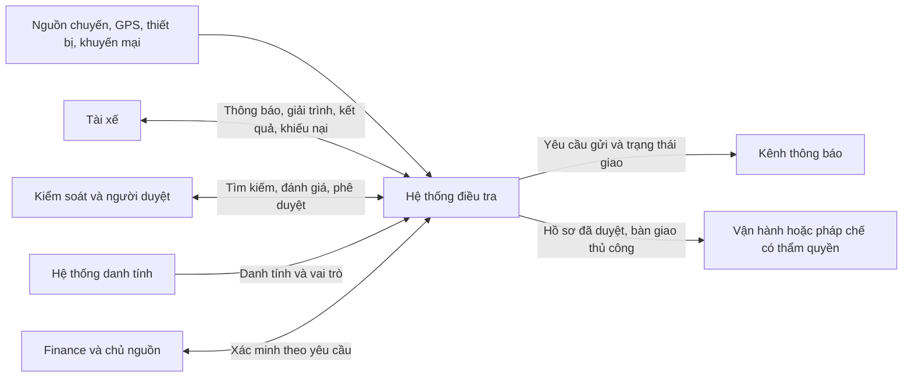

# Phạm vi và ranh giới hệ thống

## Phạm vi MVP đề xuất

Một đơn vị vận hành, tiếng Việt, một nhóm kiểm soát pilot và một nhóm tài xế được xác định sau discovery. Bao gồm toàn bộ vòng đời từ dữ liệu/tiếp nhận nghi vấn đến điều tra, giải trình, kết luận và một vòng khiếu nại thông thường. Tài xế có thể truy cập qua web di động; tích hợp vào ứng dụng tài xế sẵn có là lựa chọn triển khai sau khi xác nhận khả năng tích hợp.

| Năng lực | MVP | Sau pilot / điều kiện |
| --- | --- | --- |
| Bất thường GPS, chuyến ngắn lặp, dùng chung thiết bị, khuyến mại | Quy tắc giải thích được; ngưỡng hiệu chỉnh; kiểm soát xét từng hồ sơ | ML/anomaly theo nhóm đồng đẳng sau khi có nhãn và baseline |
| Tìm kiếm dữ liệu và bằng chứng | Mã định danh, thời gian, loại nguồn, trạng thái, từ khóa trong nội dung được phép | OCR, tìm kiếm ngữ nghĩa và đồ thị nhiều tầng |
| Hợp tác tài xế–kiểm soát | Yêu cầu giải trình, thông báo, phản hồi, tệp, hạn xử lý, kết quả, khiếu nại | Chat thời gian thực, hỗ trợ đa ngôn ngữ |
| Bằng chứng | Nguồn, phiên bản, tính toàn vẹn, phân loại truy cập, thông tin phản bác | Tích hợp kho video/telematics quy mô lớn |
| Quản lý vụ việc | Phân công, SLA, duyệt độc lập, quyết định theo phiên bản, audit | Điều phối điều tra liên vùng và tổ chức vụ việc nhóm |
| Tài chính | Số tiền nghi vấn và số tiền xác nhận là trường khác nhau; dẫn tham chiếu đối soát nếu có | Ghi nhận thu hồi thực tế qua sổ cái tích hợp |
| Báo cáo | Chất lượng hồ sơ, SLA, tải hàng đợi, phản hồi, khiếu nại | Tối ưu tổn thất và chiến lược chống gian lận nâng cao |

Nghi vấn lạm dụng thưởng có thể điều tra bằng dữ liệu chuyến và chính sách. Nếu chưa có sổ chi trả, hồ sơ phải ghi **chưa xác nhận đã chi tiền**; không suy ra thiệt hại từ giá trị thưởng cấu hình.

## Ngoài phạm vi MVP

- Tự động khóa tài khoản, trừ tiền, áp dụng kỷ luật hoặc thay đổi hợp đồng. Kết luận tạo hồ sơ bàn giao cho quy trình có thẩm quyền, không trực tiếp thi hành chế tài.
- Xây nền tảng đặt xe, điều phối xe, CRM, sổ cái hay xác thực danh tính quốc gia mới.
- Giám sát đời tư ngoài ngữ cảnh dịch vụ, thu thập tràn lan nội dung điện thoại, sinh trắc học hoặc nhận diện khuôn mặt.
- Chứng nhận hồ sơ có giá trị tố tụng; quy trình bàn giao pháp lý phải được xác lập riêng.
- Phát hiện đầy đủ mọi gian lận, cam kết xác suất chính xác khi chưa hiệu chỉnh, hoặc dùng LLM tự kết luận.
- Chương trình thưởng tố giác; tài xế có thể báo vấn đề của chuyến mình trong MVP, tố giác người khác chuyển kênh chuyên trách.

## Bối cảnh và các hệ thống ngoài

Hệ thống nguồn là nơi xác nhận sự kiện vận hành; hệ thống điều tra giữ bản chụp đã thu thập và lịch sử suy luận. Việc sửa dữ liệu nguồn phải tạo phiên bản đối chiếu, không âm thầm thay nội dung đang được viện dẫn. Nhà cung cấp thông báo chứng minh trạng thái gửi/giao theo khả năng kênh, không tự chứng minh người nhận đã đọc.

## Ranh giới hồ sơ và quyền xem

Một hồ sơ chính gắn **một tài xế và một sự việc/khoảng thời gian xác định**, có thể có nhiều loại dấu hiệu và nhiều chuyến. Một tài xế có nhiều sự việc thì có thể có nhiều hồ sơ. Nghi vấn liên quan nhiều tài xế dùng liên kết nội bộ giữa các hồ sơ; không mở một màn hình chung làm lộ lời khai các bên. Liên kết chung thiết bị không tự chứng minh thông đồng.

Tài xế chỉ thấy hồ sơ đã được phát hành cho mình và bản thông tin đã che dữ liệu bên thứ ba; không thấy hàng đợi nội bộ, điểm rủi ro hoặc ngưỡng phát hiện. Quyền xem phải đủ để hiểu và phản hồi các sự kiện bị nêu. Nếu che dữ liệu làm mất khả năng giải trình, kiểm soát cần cung cấp bản mô tả thay thế có kiểm duyệt.

## Điều kiện đầu vào

MVP cần chủ nguồn dữ liệu, định danh tài xế đáng tin cậy, bộ quy chế có hiệu lực, người điều tra/người duyệt độc lập, kênh liên hệ và căn cứ xử lý dữ liệu được xác nhận. Thiếu một nguồn thì đánh dấu năng lực phụ thuộc chưa khả dụng; không hiển thị là “không có gian lận”. Những điều kiện này là hạng mục chuẩn bị pilot, không cản trở việc hoàn thiện BA và thử với dữ liệu tổng hợp.
