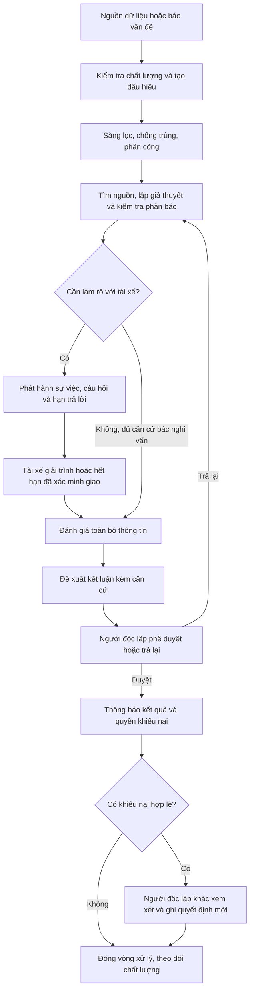
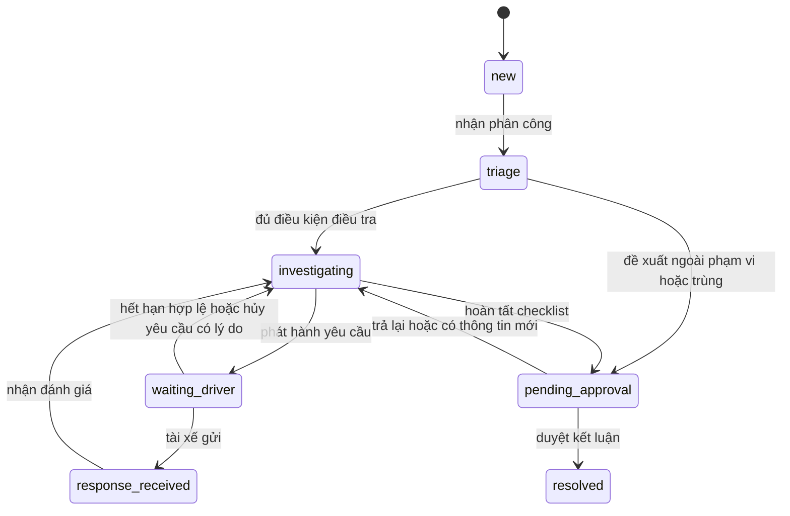

# Quy trình hiện tại và quy trình đích

## As-is: tách quan sát khỏi giả thuyết

Luồng quan sát được trong [prototype](../../README.md): nguồn tổng hợp → quy tắc → tín hiệu → cảnh báo → chính sách định tuyến → hồ sơ kiểm soát nội bộ → kết luận. Điểm rủi ro đến từ trọng số quy tắc; probability/confidence chưa có ở adapter hiện tại. Giải trình lịch sử còn đọc được nhưng không có luồng ghi giải trình mới. Đây là hiện trạng phần mềm, không phải mô tả cách doanh nghiệp đang làm việc.

As-is vận hành cần khảo sát: nhận nghi vấn từ báo cáo/hỗ trợ → tìm dữ liệu nhiều hệ thống → liên hệ tài xế → tổng hợp thủ công → xin kết luận → lưu kết quả. Chưa có căn cứ khẳng định doanh nghiệp sử dụng Excel, email hay một CRM cụ thể. Khi khảo sát phải ghi người làm, hệ thống, đầu vào/ra, thời gian thao tác/chờ và lỗi bàn giao của từng bước.

## To-be: phối hợp hai bên theo hồ sơ

Mọi đề xuất **xác nhận gian lận** phải có cơ hội giải trình: yêu cầu đã được giao, đã phản hồi hoặc đã hết hạn hợp lệ. Có thể bác nghi vấn kỹ thuật mà không yêu cầu tài xế làm thêm. Không phản hồi không được coi là thừa nhận; người điều tra vẫn phải chứng minh căn cứ. Rủi ro an toàn khẩn cấp chuyển kênh vận hành khẩn cấp riêng, không bỏ qua kiểm tra bằng chứng để kết luận tự động.

## Trạng thái hồ sơ đích

`case_status` biểu diễn công việc; `resolution` biểu diễn kết quả. Các giá trị dưới đây là **thiết kế nghiệp vụ mới**, không đồng nhất với enum đã có trong code.

| Chuyển trạng thái | Chủ thể | Điều kiện bắt buộc và sự kiện lưu |
| --- | --- | --- |
| `new → triage` | Kiểm soát/điều phối | Có owner; ghi người nhận và thời điểm |
| `triage → investigating` | Kiểm soát | Đúng phạm vi; kiểm tra trùng và chất lượng nguồn |
| `triage → pending_approval` | Kiểm soát | Mã lý do ngoài phạm vi/trùng, hồ sơ tham chiếu nếu trùng |
| `investigating → waiting_driver` | Kiểm soát | Bản công bố đã che dữ liệu, câu hỏi cụ thể, chính sách hạn; log gửi; chưa tính hạn phản hồi khi chưa giao |
| `waiting_driver → response_received` | Tài xế hoặc hỗ trợ có ủy quyền | Danh tính/quyền hợp lệ, nội dung được lưu bền vững, có biên nhận |
| `waiting_driver → investigating` | Tác vụ hạn hoặc kiểm soát | Hết hạn tính từ giao hợp lệ; hoặc hủy vì không còn cần làm rõ, có lý do; hủy không thay cho cơ hội phản hồi khi xác nhận gian lận |
| `response_received → investigating` | Kiểm soát | Tiếp nhận nội dung; ghi thời điểm bắt đầu đánh giá |
| `investigating → pending_approval` | Kiểm soát | Kết luận đề xuất, nguồn ủng hộ/phản bác, đánh giá giải trình, checklist đầy đủ |
| `pending_approval → resolved` | Người duyệt độc lập | Kiểm tra phiên bản hiện hành, không có thông tin mới chưa xét, quyết định và audit cùng được lưu |
| `pending_approval → investigating` | Người duyệt/hệ thống khi nhận bổ sung | Lý do trả lại hoặc tham chiếu bổ sung; đề xuất cũ được giữ trong lịch sử |

Khi lỗi nguồn hoặc chưa giao thông báo, giữ trạng thái công việc và đặt `block_reason`, `blocked_since`, người xử lý và lần kiểm tra kế tiếp. Không tạo vô số trạng thái cho từng lỗi kỹ thuật. Đồng hồ tổng thời gian hồ sơ luôn chạy; việc dừng một SLA phải có lý do và thời gian dừng riêng.

## Kết luận, đóng hồ sơ và khiếu nại

| `resolution` | Ý nghĩa | Điều kiện |
| --- | --- | --- |
| `confirmed_fraud` | Đủ căn cứ theo quy chế phiên bản có hiệu lực | Thỏa RULE-08; đã xét giải trình và được người khác duyệt |
| `not_fraud` | Dữ liệu/bối cảnh giải thích hợp lệ hoặc nghi vấn được bác | Nêu căn cứ phản bác; tránh ghi người bị nghi vấn là gian lận |
| `inconclusive` | Thiếu/mâu thuẫn căn cứ, chưa thể xác nhận hoặc bác bỏ | Ghi dữ liệu còn thiếu và điều kiện xem xét lại; không là nhãn huấn luyện dương/âm |
| `out_of_scope` | Không thuộc loại vụ việc xử lý ở đây | Ghi nơi chuyển và người nhận, nếu có |
| `duplicate` | Cùng sự việc đã có hồ sơ chủ | Liên kết hồ sơ chủ; không tính thêm vụ việc hay tổn thất |

Khiếu nại là thực thể riêng, có trạng thái `submitted → reviewing → decided`; yêu cầu không hợp lệ chuyển `rejected` kèm lý do và hướng dẫn. Hồ sơ gốc vẫn `resolved`, hiển thị huy hiệu đang khiếu nại. Quyết định khiếu nại là giữ nguyên, sửa hoặc hủy; tạo `decision_version` mới và đánh dấu quyết định có hiệu lực. Không xóa hoặc sửa trực tiếp bản trước.

Một vòng khiếu nại thông thường được đưa vào MVP. Sau khi hết hạn hoặc đã giải quyết, bằng chứng mới trọng yếu được tiếp nhận qua yêu cầu xem xét đặc biệt do trưởng kiểm soát/pháp chế phân công độc lập; không ghi đè lịch sử hay tự bỏ qua. Đây không phải giới hạn đối với quyền pháp lý hoặc quy chế doanh nghiệp cần xác nhận.

## SLA đề xuất để thẩm định

Lịch làm việc kiểm soát giả định: 08:00–17:00, thứ Hai–thứ Sáu, Asia/Ho_Chi_Minh, trừ lịch nghỉ cấu hình. “Giờ làm việc” chỉ tính trong lịch này; “giờ liên tục” tính cả ngoài giờ. Mỗi hồ sơ chụp phiên bản lịch và SLA tại thời điểm tạo yêu cầu.

| Công việc | Mốc bắt đầu → kết thúc | Mục tiêu đề xuất |
| --- | --- | --- |
| Sàng lọc | Tạo hồ sơ → nhận phân công và triage | 8 giờ làm việc |
| Tài xế phản hồi | `delivered_at` hợp lệ → biên nhận phản hồi | 48 giờ liên tục; nhắc trước hạn 12 giờ |
| Giao thất bại | Lần gửi lỗi → chuyển hỗ trợ xác minh kênh | 4 giờ làm việc; chưa tính hạn tài xế |
| Đánh giá giải trình | Biên nhận → đề xuất hoặc yêu cầu bổ sung có lý do | 16 giờ làm việc |
| Duyệt kết luận | Nhận đề xuất → duyệt/trả lại | 8 giờ làm việc |
| Tiếp nhận khiếu nại | Giao kết luận → gửi yêu cầu | 7 ngày lịch |
| Xử lý khiếu nại | Nhận yêu cầu hợp lệ → quyết định và thông báo | 5 ngày làm việc |

Gia hạn do tài xế đề nghị, sự cố hệ thống hoặc cần xác minh phải có người chấp thuận, lý do, hạn cũ/mới và thông báo. Gửi lặp không làm bắt đầu lại hạn. Có bổ sung nội dung bất lợi trọng yếu thì phải phát hành lại phần bổ sung và cho thời gian phản hồi theo chính sách, không tận dụng hạn cũ đã hết.

`delivered_at` chỉ lấy từ xác nhận giao của kênh đã được nghiệp vụ chấp nhận hoặc sự kiện tài xế đã xác thực mở bản yêu cầu trong cổng. Phản hồi API “đã nhận yêu cầu gửi” không phải bằng chứng giao. Kênh không cung cấp xác nhận giao phải dùng phương thức thay thế đã xác minh và ghi căn cứ; không tự gán giờ gửi thành giờ giao. `read_at` chỉ có khi đo được, để null nếu không có; đã giao vẫn không có nghĩa đã đọc.

## Các ngoại lệ bắt buộc

- Tài xế gửi đúng lúc tác vụ hết hạn chạy: dùng thời điểm máy chủ ghi nhận; nội dung đến trước/đúng hạn được tính đúng hạn; sau hạn vẫn tiếp nhận và gắn cờ trễ. Nếu đang chờ duyệt, trả về điều tra; nếu đã kết luận, chuyển luồng khiếu nại/xem xét lại.
- Hai người cùng nhận việc hoặc duyệt: chỉ một thay đổi trên phiên bản hiện hành thành công; người còn lại phải tải lại.
- Tệp bị cách ly: vẫn nhận giải trình chữ, thông báo phần tệp chưa dùng được; không kết luận khi tệp trọng yếu đang chờ xác minh.
- Thay đổi người phụ trách: giữ toàn bộ timeline và hạn; không reset để cải thiện số SLA.
- Nguồn đính chính sau kết luận: lưu phiên bản mới, thông báo người có thẩm quyền đánh giá tác động, liên kết yêu cầu xem xét lại.
