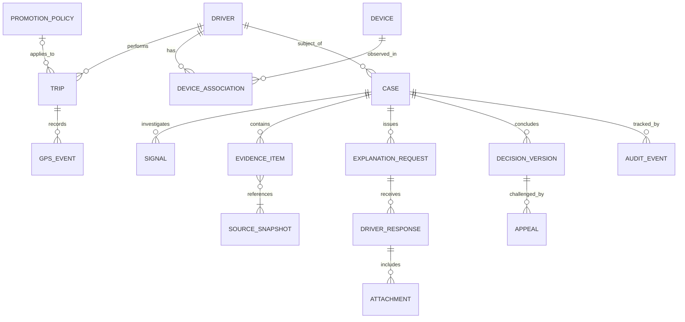

# Yêu cầu dữ liệu và thuật ngữ

## Mô hình khái niệm đích

Đây là mô hình nghiệp vụ, không ép cách lưu bảng. `CASE` có thể chưa có signal nếu bắt đầu từ phản ánh thủ công; trước khi kết luận phải có hồ sơ căn cứ theo quy tắc tương ứng. Bằng chứng có thể tham chiếu nhiều bản ghi nguồn; bản nguồn có thể phục vụ nhiều hồ sơ với quyền khác nhau. `SIGNAL` được liên kết qua alert trong implementation nếu kiến trúc giữ cấu trúc hiện tại.

## Danh mục nguồn và khoảng trống

| Nguồn | Dữ liệu tối thiểu cần có | Chủ nguồn giả định / thực trạng |
| --- | --- | --- |
| Chuyến | ID hệ thống nguồn, tài xế, trạng thái, thời gian, tọa độ, loại dịch vụ, quãng đường và tiền theo đơn vị | Vận hành chuyến; prototype có phần lớn trường cơ bản, thiếu nhiều trạng thái/bối cảnh |
| GPS | event ID, trip/driver ID, event time, received time, sequence, lat/lon; accuracy/provider nếu có | Mobile/telematics; prototype có vị trí/thời gian, chưa đủ metadata chất lượng |
| Thiết bị | Mã thiết bị đã token hóa, liên kết tài khoản, khoảng sử dụng, nguồn cấp phát | Nhóm danh tính/đội xe; mẫu có first/last seen, chưa có sổ cấp phát |
| Khuyến mại | Mã và version, hiệu lực, điều kiện đủ, khoản thưởng, chương trình áp dụng | Chủ chính sách thưởng; mẫu có một số trường, không phải eligibility ledger |
| Chi trả | Transaction ID, loại tiền, số tiền, trạng thái, thời điểm và khoản đảo/thu hồi | Finance; chưa có tích hợp được quan sát |
| Sự cố vận hành | Mã sự cố mạng/app/đội xe, thời gian ảnh hưởng, nguồn xác nhận | Operations; nguồn đề xuất để kiểm tra phản bác |
| Giải trình và tệp | Request/response ID, người gửi đã xác thực, thời gian, version, nội dung, tệp và trạng thái quét | Tài xế/hỗ trợ; hiện chỉ có lịch sử trong prototype |

Không coi dữ liệu thanh toán, khách hàng, CAN/xe hoặc camera là đã sẵn sàng. Chỉ bổ sung khi chứng minh cần cho use case, có quyền và kiểm tra chất lượng. Mã khách hàng token hóa có thể cần cho nghiên cứu thông đồng sau pilot; không mặc định thu nội dung liên lạc.

## Từ điển dữ liệu lõi

| Đối tượng | Trường chính và nghĩa nghiệp vụ | Quy tắc |
| --- | --- | --- |
| Định danh | `source_system`, `external_id`, `internal_id`, `entity_type` | Cặp nguồn+mã ngoài là khóa liên kết; không dùng tên/số điện thoại làm khóa tự động |
| Thời gian | `event_at`, `received_at`, `indexed_at`, `effective_from/to` | Có timezone; lưu UTC, hiển thị Asia/Ho_Chi_Minh; giữ độ lệch thay vì sửa âm thầm |
| Chuyến | `trip_id`, `driver_id`, `status`, `started_at`, `ended_at`, pickup/dropoff, `distance_km` | Thời lượng dương với chuyến hoàn tất; thiếu trạng thái phải ghi không biết, không tự coi hoàn tất |
| GPS | `event_id`, trip/driver, lat/lon, `accuracy_m`, provider, sequence | Latitude [-90,90], longitude [-180,180]; thiếu accuracy là null; event đến trễ vẫn giữ nguyên |
| Tiền | `amount`, `currency`, `transaction_id`, `payment_status`, `related_adjustment_id` | Decimal, không float; không gộp khác tiền tệ; tiền gắn chuyến không tự là tiền đã trả |
| Tín hiệu/cảnh báo | rule/type, measured values, threshold, risk, probability/confidence, impact, quality | Phân biệt null với 0; risk không suy ra probability; snapshot theo phiên bản |
| Hồ sơ | `case_id`, `subject_driver_id`, owner, unit, period, status, resolution, priority, version | Một tài xế/sự việc; status và resolution độc lập; liên kết duplicate/master rõ |
| Bằng chứng | `evidence_id`, origin, snapshot IDs, collected_by/at, hash+algorithm, statement, method, quality, verification, relevance | Relevance: support/refute/unclear; verification: unverified/verified/disputed/integrity_failed; tính toàn vẹn không chứng minh nội dung đúng |
| Bản nguồn | source ID/version, acquired_at, acquisition method, original payload/location, content hash | Bản gốc và dẫn xuất riêng; nguồn sửa tạo version; quyền nguồn truyền tới dữ liệu dẫn xuất |
| Yêu cầu | request ID/version, case, event facts, questions, public evidence IDs, sent/delivered/read, due_at, SLA policy | Nội dung đã phát hành bất biến; hạn chỉ tính theo giao hợp lệ |
| Giải trình | response ID/version, request, actor, acting_on_behalf_of, submitted_at, text, receipt | Chỉ bổ sung; ghi xác minh/ủy quyền nếu gửi hộ; thời gian client không quyết định hạn |
| Tệp | file ID, original name, MIME detected, size, hash, scan status, access class, original/derived link | Tệp cách ly chưa được preview/index nội dung; bản che có hash riêng |
| Quyết định | decision ID/version, resolution, policy version, evidence IDs, response IDs, rationale, proposer, approver, effective flag | Một version hiện hành; giữ lịch sử; ghi căn cứ thay đổi |
| Khiếu nại | appeal ID, decision challenged, submit time, reason, reviewer, status, outcome, resulting decision, remedy task | Người xử lý độc lập; một vòng thông thường và nhánh xem xét đặc biệt có căn cứ |
| Audit | event ID, actor/role, action, object/version, time, purpose, result, correlation ID | Không ghi toàn văn dữ liệu nhạy cảm vào log kỹ thuật; append-only đối với người dùng vận hành |

## Yêu cầu dữ liệu có định danh

| Mã | Yêu cầu | Kiểm tra chấp nhận |
| --- | --- | --- |
| DR-01 | Định danh và quan hệ nguồn nhất quán | Không gắn GPS của người A vào chuyến người B; mã ngoài không trộn với khóa DB |
| DR-02 | Giữ thời gian sự kiện/nhận và đơn vị đo | Truy vấn cắt ngày địa phương đúng biên; thấy được dữ liệu đến trễ |
| DR-03 | Chất lượng và độ mới được công bố | Có số bản lỗi/trùng/thiếu, watermark, lý do không đánh giá được |
| DR-04 | Bản chụp, lineage và toàn vẹn | Tái dựng đúng tập nguồn đã dùng khi kết luận kể cả nguồn sửa sau đó |
| DR-05 | Quy tắc/đánh giá có version và trường chưa biết | Đọc được tham số cũ; null không bị biến thành 0 hoặc tỷ lệ chắc chắn |
| DR-06 | Ownership, trường được che và mục đích truy cập | Quyền lan tới chỉ mục, snippet, aggregate, tệp và export |
| DR-07 | Trao đổi có phiên bản và bằng chứng giao | Phân biệt đã gửi/đã giao/đã đọc; biên nhận không nhân đôi |
| DR-08 | Quyết định/khiếu nại/audit bất biến theo version | Biết ai đã duyệt điều gì trên dữ liệu nào, tại thời điểm nào |
| DR-09 | Tiền và nhãn đánh giá có nguồn riêng | Chứng từ tiền không trùng; nhãn chưa xác định không ép nhị phân |
| DR-10 | Lưu/xóa/hold có chính sách theo mục đích | Hết hạn ở dữ liệu, bản dẫn xuất và chỉ mục; hold chặn xóa đúng phần |

## Vòng đời dữ liệu đề xuất

| Nhóm | Nguyên tắc | Điểm cần quyết định trước dùng dữ liệu thật |
| --- | --- | --- |
| GPS và nguồn vận hành | Chỉ lấy phạm vi thời gian/mục đích cần thiết; phân tầng truy cập | Thời hạn giữ bản thô, cửa sổ tìm kiếm và quyền truy xuất lịch sử |
| Hồ sơ, bằng chứng, trao đổi | Giữ đủ vòng giải trình/khiếu nại và nghĩa vụ đã xác định | Thời hạn sau đóng hồ sơ theo loại vụ việc/hợp đồng; không đặt số năm như yêu cầu pháp luật chưa kiểm chứng |
| Tệp gốc và bản đã che | Liên kết phiên bản và lịch lưu; hạn chế tải bản gốc | Quyền bên thứ ba, quy trình ẩn/che và xác minh tài liệu |
| Audit và export | Ít dữ liệu cá nhân cần thiết; export có người nhận/mục đích/hạn | Thời hạn audit, quyền tải, trách nhiệm bản đã tải ra ngoài |
| Backup | Lịch hết hạn riêng, kiểm soát truy cập, đối soát yêu cầu xóa khi restore | RPO/RTO và lịch hủy; không tuyên bố xóa ngay khỏi mọi bản backup |
| Legal hold | Ghi căn cứ, phạm vi, người duyệt, ngày rà soát và kết thúc | Pháp chế xác định trường hợp áp dụng; hold không đồng nghĩa giữ tất cả vô hạn |

Đề xuất này cần được đầu mối dữ liệu đối chiếu với Luật Bảo vệ dữ liệu cá nhân và văn bản hướng dẫn hiện hành; ngày hiệu lực đã kiểm tra trong [danh mục nguồn](13-research-and-solution-options.md). Chưa có kết luận về căn cứ xử lý cụ thể của doanh nghiệp.

## Thuật ngữ

- **Signal:** dấu hiệu đo được. **Alert:** tập dấu hiệu được gom để xem xét. **Case:** hồ sơ công việc điều tra.
- **Evidence:** tài liệu/dữ liệu dùng kiểm tra một nhận định; có thể ủng hộ hoặc phản bác. **Lineage:** đường truy ngược từ kết quả về nguồn và phép biến đổi.
- **Chain of custody:** lịch sử thu nhận, truy cập, chuyển giao và bảo quản bằng chứng. **Hash:** dấu kiểm tính toàn vẹn của nội dung đã thu nhận, không xác nhận tính trung thực trước lúc thu.
- **Risk score:** điểm ưu tiên theo quy tắc. **Fraud probability:** xác suất do mô hình đã đánh giá/hiệu chỉnh cung cấp. **Confidence:** mức tin cậy có định nghĩa và phương pháp riêng. **Impact:** mức ảnh hưởng, không đồng nghĩa điểm rủi ro.
- **Resolution:** kết luận nghiệp vụ. **Appeal:** yêu cầu xem xét lại kết luận. **Disposition/remedy:** tác vụ xử lý/khắc phục được bàn giao, không phải bản thân kết luận.
- **Ground truth:** nhãn tham chiếu được thẩm định; vẫn có thể được sửa khi có thông tin mới. **False positive:** cảnh báo mà đánh giá xác nhận không gian lận; không dùng cho mọi hồ sơ chưa kết luận.
