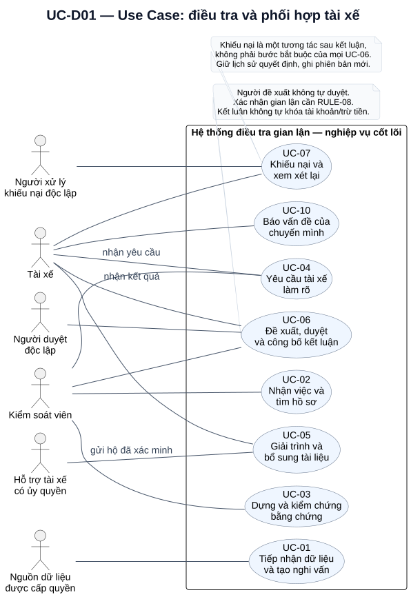
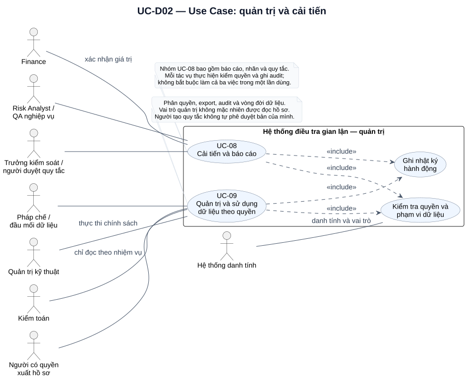

# UML Use Case Diagram

Sơ đồ trả lời ai tương tác với chức năng nào trong ranh giới hệ thống. Các mã UC giữ nguyên [danh mục use case](08-use-cases-and-user-stories.md). Association giữa actor và use case mô tả tham gia, không phải thứ tự các bước hoặc quyền xem mọi dữ liệu trong use case.

## UC-D01 — Điều tra và phối hợp hai bên

[Mở SVG](diagrams/svg/uc-01-investigation.svg) · [Mã nguồn PlantUML](diagrams/src/uc-01-investigation.puml)

- Tài xế nhận yêu cầu/kết quả, giải trình, khiếu nại và báo vấn đề chuyến mình. Việc cùng liên kết UC-06 không cho tài xế quyền duyệt kết luận.
- Kiểm soát nhận việc, tìm dữ liệu, dựng căn cứ, phát hành câu hỏi và đề xuất kết luận; người duyệt khác người đề xuất trên cùng hồ sơ.
- Người xử lý khiếu nại khác cả người điều tra và người duyệt trước. Hỗ trợ chỉ gửi hộ khi đã xác minh/ủy quyền, có actor và audit riêng.
- Nguồn dữ liệu ở ngoài hệ thống; bộ phát hiện và tác vụ lịch chạy bên trong là hành vi nội bộ của UC-01, không vẽ thành người dùng bên ngoài.

Không nối UC-04 → UC-05 → UC-06 bằng `include` để mô tả trình tự. Yêu cầu, phản hồi và kết luận có thể xảy ra ở các phiên làm việc khác nhau. Khiếu nại là use case riêng sau kết luận, không phải bước luôn phải chạy của UC-06. Trình tự xem [Activity](20-uml-activity-diagrams.md) và [Sequence](21-uml-sequence-diagrams.md).

## UC-D02 — Quản trị và cải tiến

[Mở SVG](diagrams/svg/uc-02-governance.svg) · [Mã nguồn PlantUML](diagrams/src/uc-02-governance.puml)

UC-08 gom các tác vụ báo cáo, đánh giá nhãn và quản trị phiên bản quy tắc. UC-09 gom các tác vụ quyền, audit, export, lưu/hold/xóa dữ liệu theo nhiệm vụ. Mỗi tác vụ phải kiểm phạm vi dữ liệu và ghi nhật ký nên hai hành vi này dùng quan hệ `<<include>>`. Mũi tên chỉ từ use case gọi đến hành vi được bao gồm.

Hai hành vi dùng chung là phân rã nội bộ của UC hiện có, không tạo thêm mã UC hoặc mở rộng phạm vi FR. Cả UC-01–07 và UC-10 cũng chịu kiểm quyền/audit theo FR-15/16; quan hệ lặp này được lược ở UC-D01. Ma trận quyền chi tiết tại [tài liệu 03](03-stakeholders-and-roles.md) quyết định quyền thực tế của từng actor, không suy từ association tổng quan.

Ký pháp được đối chiếu với [tài liệu Use Case của PlantUML](https://plantuml.com/use-case-diagram). Đây là nguồn về cách biểu diễn, không phải nguồn của quy chế nghiệp vụ.
