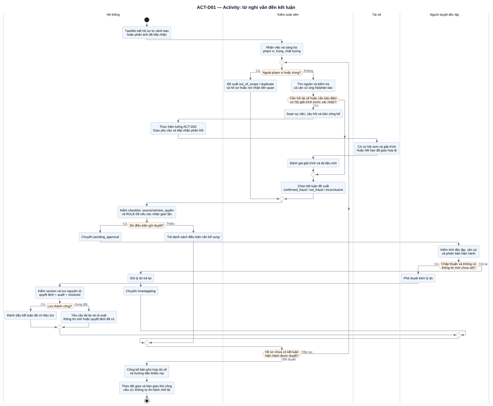
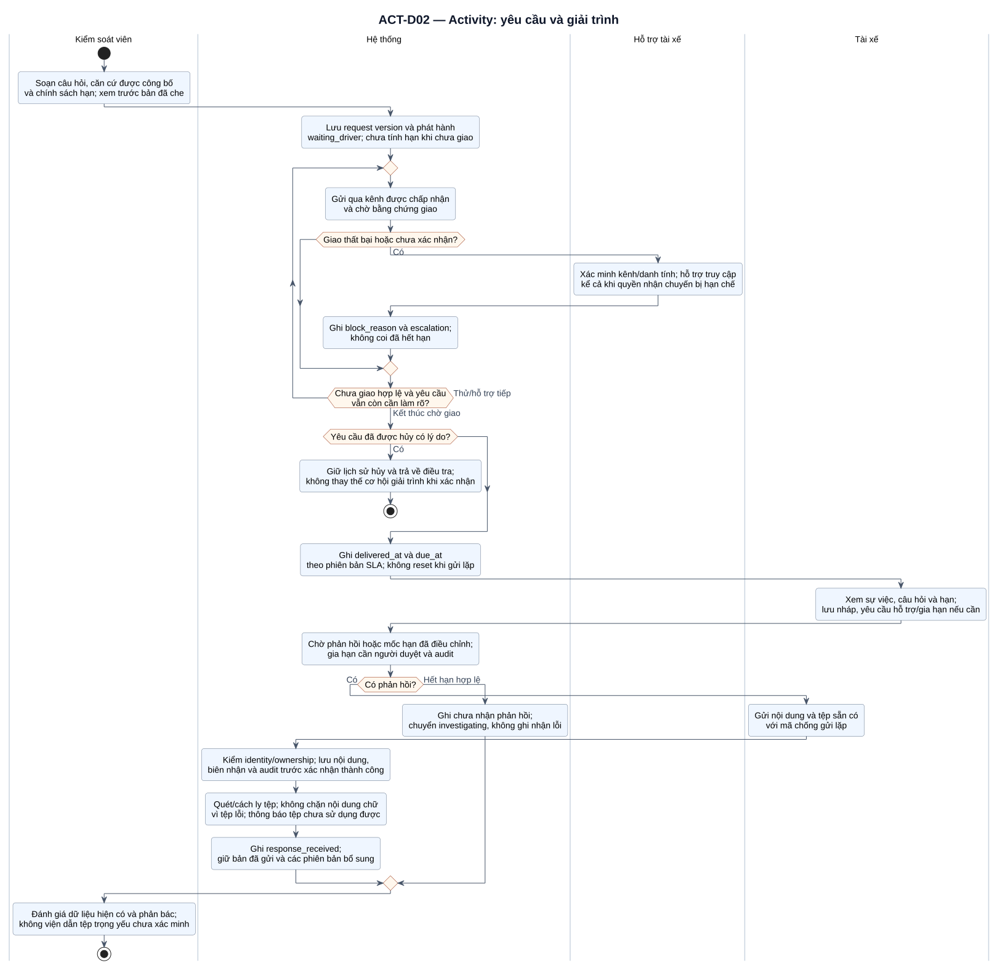
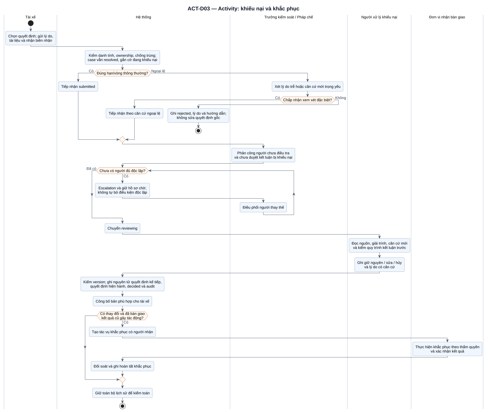

# UML Activity Diagram có swimlane

Các làn chỉ người/bộ phận chịu trách nhiệm cho hoạt động; hình thoi là điều kiện có nhánh lựa chọn, mũi tên là luồng điều khiển. Các nhánh chờ hoặc xử lý ngoại lệ không cho phép bỏ điều kiện độc lập, quyền hoặc chất lượng nguồn. Đối chiếu trạng thái tại [tài liệu 04](04-current-and-target-business-processes.md).

## ACT-D01 — Điều tra và phê duyệt

[Mở SVG](diagrams/svg/act-01-investigation.svg) · [Mã nguồn](diagrams/src/act-01-investigation.puml)

Sơ đồ bao phủ sàng lọc ngoài phạm vi/trùng, kiểm chứng, yêu cầu tài xế làm rõ, đề xuất và duyệt độc lập. Bước gọi ACT-D02 là một hoạt động con gồm trao đổi không đồng bộ; không yêu cầu tài xế phản hồi ngay trong phiên của kiểm soát. Bước trong làn tài xế tóm tắt cơ hội tham gia của họ, không tạo thêm một lần giải trình sau ACT-D02.

Nhánh thiếu checklist/trả lại/quyết định cạnh tranh dẫn về rà soát. Khi cạnh tranh đã tạo một quyết định hợp lệ, tải lại bản hiện hành, không duyệt lần hai. Nếu có thông tin mới làm thay đổi căn cứ, quay lại `investigating` trước khi đưa đề xuất mới. Nhánh xác nhận gian lận phải thỏa RULE-08; các nhánh khác vẫn cần lý do và căn cứ phù hợp, không được dùng điểm số thay bằng chứng.

## ACT-D02 — Yêu cầu và giải trình

[Mở SVG](diagrams/svg/act-02-explanation.svg) · [Mã nguồn](diagrams/src/act-02-explanation.puml)

Phân biệt gửi, giao và đọc. Vòng chờ giao có tác vụ hỗ trợ/escalation và lịch kiểm tra; không phải vòng retry vô hạn không giới hạn tốc độ. Hủy yêu cầu có lý do không thay thế cơ hội giải trình khi vẫn muốn xác nhận gian lận. Hết hạn chỉ có nghĩa chưa nhận phản hồi đúng hạn.

Giải trình chữ và tệp có trạng thái riêng. Hệ thống cấp biên nhận sau khi lưu bền vững; tệp còn cách ly/chờ quét chưa được coi là căn cứ xác minh. Nội dung bổ sung sau hạn vẫn tiếp nhận: hồ sơ đang chờ duyệt trở về điều tra; hồ sơ đã `resolved` đi qua khiếu nại/xem xét lại, xem SEQ-D02. Quyền vào cổng phản hồi tách khỏi quyền nhận chuyến.

## ACT-D03 — Khiếu nại và khắc phục

[Mở SVG](diagrams/svg/act-03-appeal.svg) · [Mã nguồn](diagrams/src/act-03-appeal.puml)

Yêu cầu ngoài hạn/vòng thông thường được xét căn cứ ngoại lệ, không tự bác vì thời gian đã trôi qua. Khi chưa có người độc lập, tiếp tục phân công/escalation; không để người liên quan tự xử lý. Việc khắc phục chỉ hoàn tất khi có kết quả xác nhận của người nhận bàn giao, không chỉ vì nhãn kết luận đã đổi.

Các nhánh lỗi quyền, mất mạng và cạnh tranh không vẽ lặp toàn bộ ở đây; điều kiện bắt buộc áp dụng theo FR-09/12/14/15 và [Sequence](21-uml-sequence-diagrams.md). Activity dùng làn và nút UML; không tuyên bố đây là BPMN 2.0. Tham chiếu cú pháp [Activity và swimlane của PlantUML](https://plantuml.com/activity-diagram-beta).
