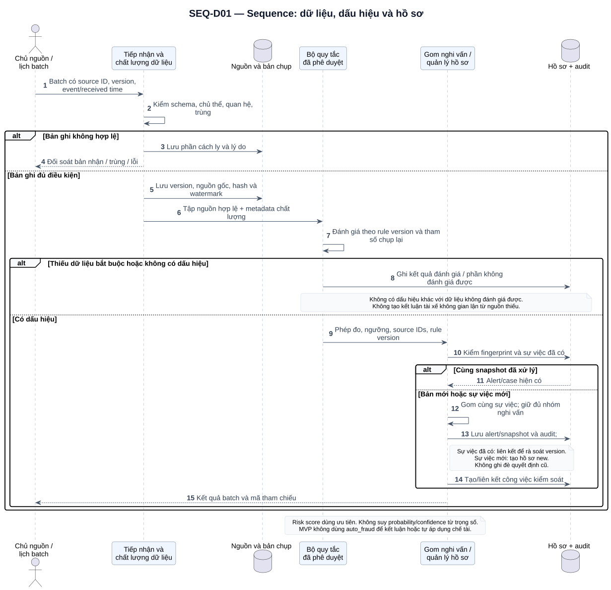
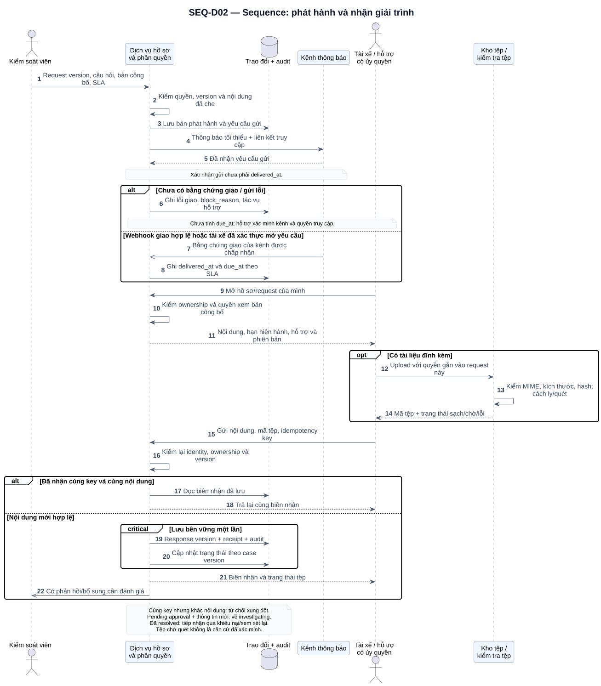
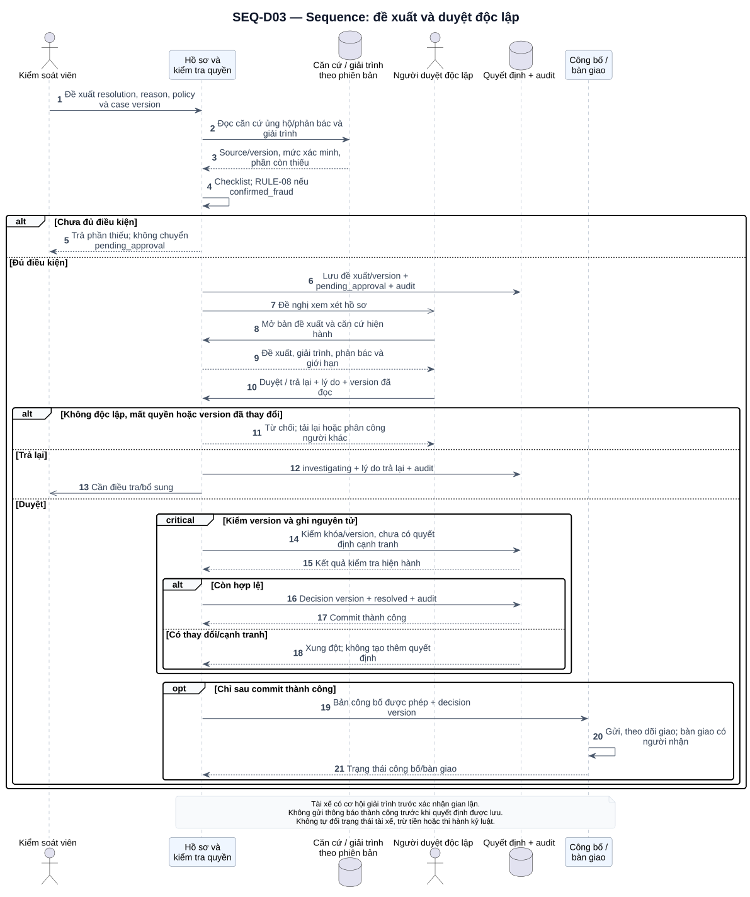
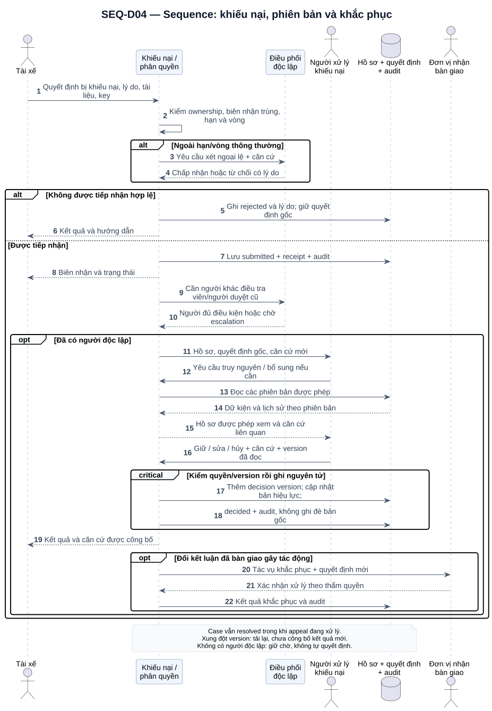

# UML Sequence Diagram

Các sơ đồ mô tả trao đổi theo thời gian giữa tác nhân và trách nhiệm logic của hệ thống. Mũi tên liền là thông điệp/yêu cầu; đầu mũi tên mở biểu diễn thông điệp không đồng bộ; nét đứt là trả kết quả. `alt` biểu diễn nhánh thay thế, `opt` là nhánh có điều kiện, `critical` chỉ yêu cầu xử lý nhất quán/nguyên tử cần kiến trúc hiện thực, không tự chứng minh giao dịch đã được triển khai.

## SEQ-D01 — Tiếp nhận và tạo nghi vấn

[Mở SVG](diagrams/svg/seq-01-detection.svg) · [Mã nguồn](diagrams/src/seq-01-detection.puml)

FR-01–03: nguồn có phiên bản, chất lượng, quy tắc có hiệu lực, gom cùng sự việc và chống trùng. Sơ đồ vẽ luồng cho từng nhóm bản ghi; một batch có thể vừa có bản hợp lệ vừa có phần cách ly. Khi không có dấu hiệu hoặc thiếu dữ liệu, kết quả vẫn được ghi để đối soát, không tạo kết luận âm từ dữ liệu chưa đủ.

Tập nguồn/cấu hình thay đổi có thể sinh snapshot mới. Việc liên kết vào hồ sơ hiện có phải được rà soát theo sự việc và thời gian, không gộp vì cùng tài xế. Những hồ sơ đã có kết luận vẫn giữ lịch sử; thông tin mới đưa vào xem xét lại theo quy trình. Bản đích không dùng nhánh `auto_fraud` để tự xác nhận gian lận.

## SEQ-D02 — Phát hành và nhận phản hồi

[Mở SVG](diagrams/svg/seq-02-explanation.svg) · [Mã nguồn](diagrams/src/seq-02-explanation.puml)

FR-08–10, FR-15/16: kiểm quyền cả khi phát hành, mở yêu cầu và gửi phản hồi; lưu request/response có phiên bản; xác nhận giao riêng với xác nhận gửi. Nhánh xác nhận giao trong hình là đường callback của kênh. Nếu tài xế đã xác thực mở yêu cầu, cổng ghi bằng chứng mở trực tiếp theo cùng quy tắc, không giả tạo webhook của nhà cung cấp.

Mất kết nối sau commit được xử lý bằng biên nhận và idempotency key. Dùng lại key với nội dung khác phải báo xung đột. Nội dung và tham chiếu tệp được lưu trong giao dịch nghiệp vụ; quét tệp có thể hoàn thành sau, giữ trạng thái rõ ràng. Phiên bản actor lấy từ danh tính xác thực, không tin `driver_id` do client tự khai.

## SEQ-D03 — Đề xuất, duyệt và công bố

[Mở SVG](diagrams/svg/seq-03-decision.svg) · [Mã nguồn](diagrams/src/seq-03-decision.puml)

FR-11–13: kiểm checklist trước đưa người duyệt, rồi kiểm độc lập/quyền/version tại lúc duyệt. Kiến trúc phải bảo đảm dữ liệu được duyệt không bị đổi giữa kiểm version và commit. Ghi quyết định, chuyển trạng thái và audit là một thao tác nguyên tử; chỉ công bố sau thành công. Lỗi gửi sau commit cần retry công bố cùng decision version, không tạo quyết định lần nữa.

## SEQ-D04 — Khiếu nại và kết luận kế tiếp

[Mở SVG](diagrams/svg/seq-04-appeal.svg) · [Mã nguồn](diagrams/src/seq-04-appeal.puml)

FR-14: giữ nguyên quyết định bị khiếu nại, phân công độc lập, bổ sung căn cứ và tạo quyết định kế tiếp. Dữ liệu từ kho đi qua thành phần khiếu nại/phân quyền trước trả người xử lý; người dùng không kết nối trực tiếp database. Quyền và việc che dữ liệu vẫn áp dụng trước trả dữ liệu.

Nếu việc ghi version mới xung đột, không công bố cho tài xế hoặc tạo tác vụ khắc phục cho tới khi rà soát và commit hợp lệ. Đang khiếu nại không xóa kết luận gốc, cũng không tự đình chỉ hoặc thi hành chế tài. Tác động thực tế được người có thẩm quyền xử lý ở ngoài hệ thống, có xác nhận bàn giao.
