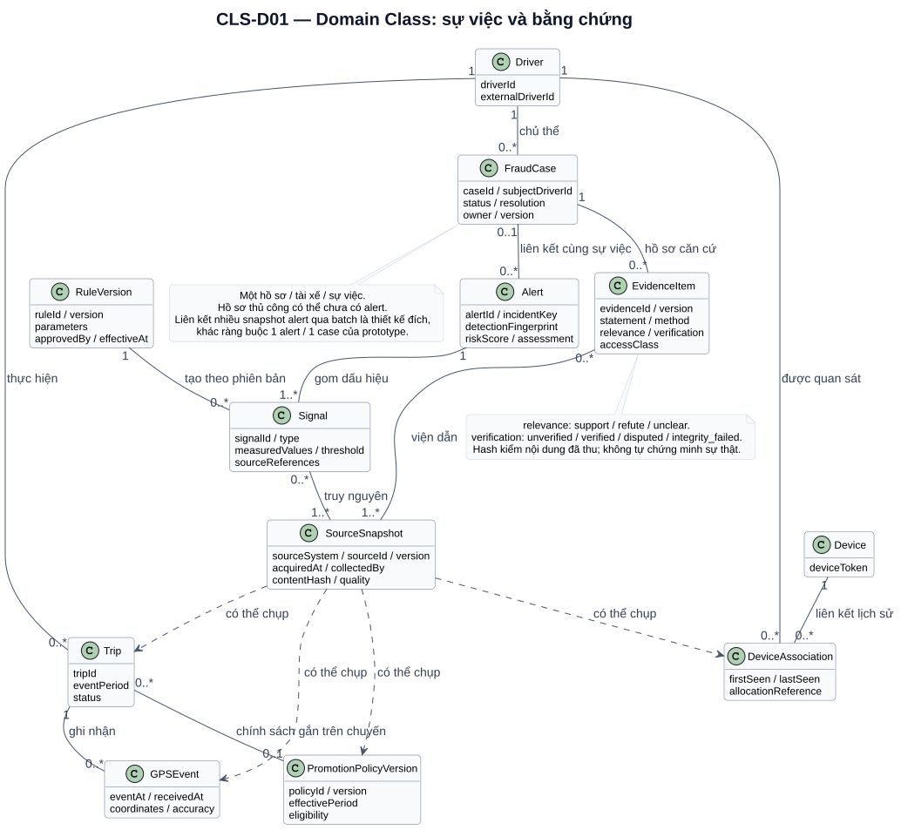
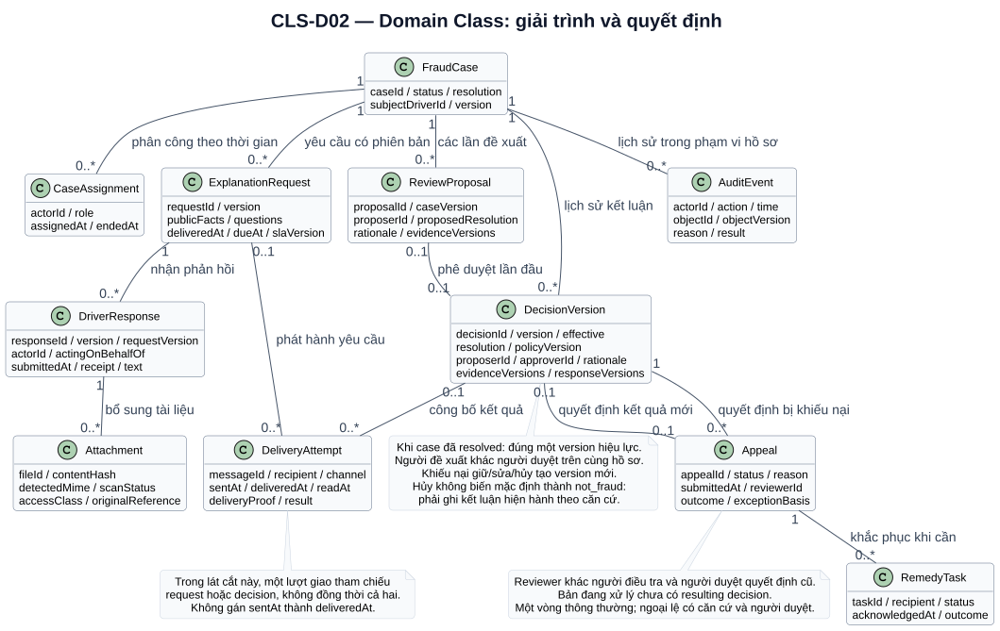

# UML Domain Class Diagram

Mô hình lớp biểu diễn đối tượng nghiệp vụ, thuộc tính có ý nghĩa và số lượng liên kết. Đây là **mô hình khái niệm đích**, không là class Python/Java hay schema database đã triển khai. So sánh với [ERD và từ điển dữ liệu](10-data-requirements-and-glossary.md) và [khoảng cách prototype](17-prototype-gap-and-transition.md).

## CLS-D01 — Sự việc, nguồn và bằng chứng

[Mở SVG](diagrams/svg/class-01-evidence.svg) · [Mã nguồn](diagrams/src/class-01-evidence.puml)

| Quan hệ | Cách đọc và ràng buộc |
| --- | --- |
| Driver — FraudCase | Một hồ sơ có đúng một tài xế là chủ thể; một tài xế có thể có nhiều sự việc |
| Driver/Device — DeviceAssociation | Lịch sử liên kết có khoảng thời gian; không đồng nhất thiết bị dùng chung với thông đồng |
| Trip — PromotionPolicyVersion | Một chuyến trong mô hình MVP gắn tối đa một chính sách; mỗi chính sách có nhiều chuyến. Khả năng so nhiều chính sách chồng lấn không tự trở thành nhiều khoản chi trên một chuyến |
| Signal — SourceSnapshot | Mỗi dấu hiệu có ít nhất một bản nguồn để tái tính; nhiều dấu hiệu có thể dùng chung bản nguồn |
| Alert — Signal | Alert chứa ít nhất một signal snapshot; điều này không buộc tái sử dụng cùng đối tượng signal qua các lần phát hiện |
| FraudCase — Alert | Đích cho phép liên kết nhiều alert snapshot cùng sự việc vào một hồ sơ; mỗi alert liên kết tối đa một hồ sơ. Đây là mở rộng đã nêu tại FR-03, khác ràng buộc prototype |
| FraudCase — EvidenceItem | Hồ sơ mới có thể chưa có bằng chứng; trước quyết định phải có căn cứ đáp ứng quy tắc kết luận tương ứng |
| EvidenceItem — SourceSnapshot | Mỗi bằng chứng có một hay nhiều nguồn; bản nguồn được nhiều hồ sơ dùng nhưng vẫn giữ quyền và phiên bản |

Mũi tên nét đứt từ SourceSnapshot đến các loại dữ liệu chỉ sự phụ thuộc “có thể chụp nguồn loại này”, không phải kế thừa và không yêu cầu một snapshot đồng thời chứa mọi loại dữ liệu. Snapshot có định danh loại nguồn để phân biệt. Sơ đồ không vẽ tất cả nguồn như sự cố kỹ thuật hoặc payout; bổ sung chúng theo inventory và quyền đã xác nhận.

## CLS-D02 — Giải trình, quyết định và khiếu nại

[Mở SVG](diagrams/svg/class-02-workflow.svg) · [Mã nguồn](diagrams/src/class-02-workflow.puml)

| Đối tượng/quan hệ | Ràng buộc nghiệp vụ |
| --- | --- |
| CaseAssignment | Ghi actor/role và thời gian phân công; lịch sử không bị xóa khi đổi người |
| ExplanationRequest — DriverResponse | Phản hồi gắn đúng request version; một yêu cầu có thể có nhiều lần phản hồi/bổ sung |
| DriverResponse — Attachment | Mô tả tệp gắn với bản phản hồi trong lát cắt này; tệp thuộc khiếu nại hoặc nguồn khác dùng quan hệ tương tự khi thiết kế chi tiết |
| DeliveryAttempt | Một lượt giao trong hình gắn request hoặc decision; một bản phát hành có thể có nhiều lần gửi; mốc giao không tự reset theo retry |
| ReviewProposal — DecisionVersion | Đề xuất được duyệt lần đầu tạo tối đa một quyết định; đề xuất bị trả lại không có quyết định. Quyết định khiếu nại gắn Appeal riêng |
| DecisionVersion — Appeal | Có hai quan hệ khác nhau: bản bị khiếu nại và bản kết quả được tạo sau xem xét; không được hoán đổi hai khóa tham chiếu |
| Appeal — RemedyTask | Chỉ phát sinh khi cần khắc phục tác động đã bàn giao; giữ trạng thái người nhận và kết quả |
| FraudCase — AuditEvent | Đây là audit trong phạm vi hồ sơ; sự kiện đăng nhập/quản trị chung có thể không thuộc hồ sơ và nằm ngoài lát cắt |

`0..1` là tối đa một; `0..*` là không hoặc nhiều; `1..*` là ít nhất một. Liên kết thường biểu diễn association, không suy thành xóa dây chuyền trong database. Các danh sách `evidenceVersions/responseVersions` trong DecisionVersion chỉ tham chiếu các phiên bản được viện dẫn, không sao chép/sửa bản gốc.

Các ràng buộc không thể hiện hết bằng cardinality: cùng tài xế/sự việc, đúng một decision version hiệu lực sau `resolved`, không tự duyệt, reviewer khiếu nại độc lập, và thông tin mới không bị bỏ qua. Những điều kiện này phải được kiểm cùng RULE-06–12 và UAT-15–20 khi hiện thực.
