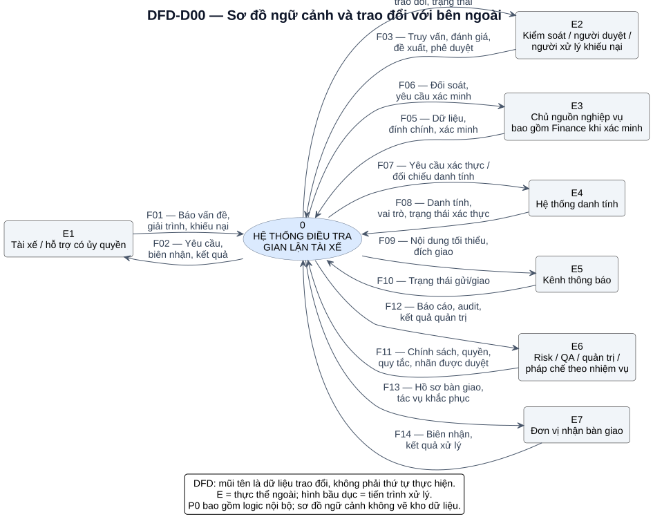
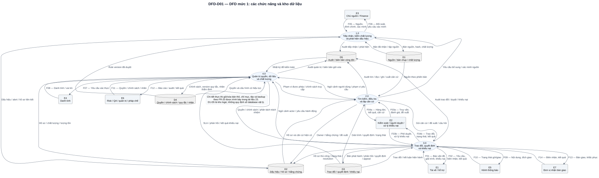
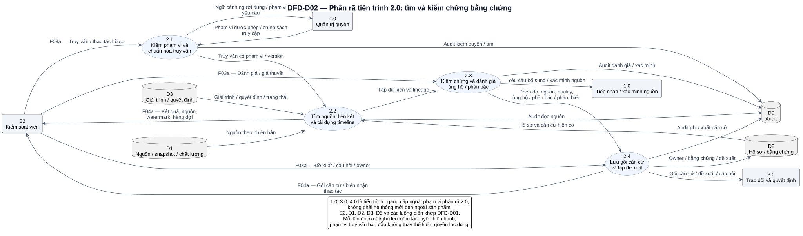

# Sơ đồ luồng dữ liệu — DFD

DFD thể hiện dữ liệu đến từ đâu, được xử lý ở đâu và được lưu ở kho logic nào. Sơ đồ này **không mô tả thứ tự thực hiện, luồng HTTP hoặc bố trí hạ tầng**. Quy trình theo thời gian nằm ở Activity/Sequence; DFD dùng để kiểm ranh giới dữ liệu, nguồn bằng chứng và quyền.

## Quy ước

| Ký hiệu | Ý nghĩa |
| --- | --- |
| E1–E7, hình chữ nhật nền xám | Thực thể ngoài ranh giới hệ thống; có thể gom các vai trò theo loại dữ liệu trao đổi |
| 0, 1.0–4.0, 2.1–2.4, hình bầu dục | Tiến trình biến đổi dữ liệu; tên là hành động nghiệp vụ |
| D1–D5, hình kho dữ liệu | Kho logic; cách biểu diễn giản lược, không tuyên bố tuân thủ nguyên dạng Yourdon/DeMarco hoặc Gane–Sarson |
| Mũi tên có nhãn | Dữ liệu đi theo một chiều; tên dòng là nội dung dữ liệu, không phải điều kiện rẽ nhánh |
| F01–F14 | Mã dòng trao đổi ngoài, giữ cân bằng giữa sơ đồ ngữ cảnh và mức 1 |

Chỉ tiến trình được đọc/ghi kho. Không có đường trực tiếp tài xế → kho, kho → kho hoặc thực thể ngoài → thực thể ngoài. Mỗi tiến trình có đầu vào đủ giải thích đầu ra; cảnh báo, bằng chứng và kết luận là ba loại dữ liệu khác nhau.

## DFD-D00 — Ngữ cảnh

[Mở SVG](diagrams/svg/dfd-00-context.svg) · [Mã nguồn](diagrams/src/dfd-00-context.puml)

E2 gom kiểm soát, người duyệt và người xử lý khiếu nại ở góc nhìn dữ liệu, không gộp quyền hoặc cho phép tự duyệt. E3 có nguồn vận hành và dữ liệu Finance xác minh khi đã được phép; không khẳng định hệ thống đã có tích hợp thanh toán. E7 xử lý tác động và khắc phục theo thẩm quyền ở ngoài hệ thống.

## DFD-D01 — Phân rã mức 1

[Mở SVG](diagrams/svg/dfd-01-system.svg) · [Mã nguồn](diagrams/src/dfd-01-system.puml)

| Tiến trình | Chức năng | FR |
| --- | --- | --- |
| 1.0 | Tiếp nhận/đính chính, kiểm chất lượng, chạy quy tắc, gom dấu hiệu và đối soát | FR-01–03 |
| 2.0 | Nhận việc, tìm nguồn, dựng timeline, kiểm chứng, lập căn cứ và đề xuất/câu hỏi | FR-04–07, FR-11, phần xuất căn cứ của FR-17 |
| 3.0 | Phát hành, nhận giải trình, SLA, duyệt, công bố, khiếu nại, báo vấn đề, bàn giao | FR-08–10, FR-12–14, FR-22 |
| 4.0 | Quyền, audit, quản trị export/vòng đời, báo cáo, quy tắc và nhãn | FR-15–21; kiểm quyền/audit áp dụng xuyên các tiến trình |

| Kho | Nội dung và trách nhiệm |
| --- | --- |
| D1 | Bản nguồn, bản chụp, dấu kiểm toàn vẹn, xuất xứ, thời gian và chất lượng; giữ phiên bản khi nguồn được đính chính |
| D2 | Dấu hiệu, alert, hồ sơ, owner, bằng chứng, mức xác minh và đề xuất; không lấy điểm số làm kết luận |
| D3 | Request, response, tệp/metadata trao đổi, bằng chứng giao, decision version, appeal, bàn giao/khắc phục |
| D4 | Quyền theo đối tượng, chính sách SLA/lưu dữ liệu, rule version, nhãn thẩm định và thông tin hiệu lực |
| D5 | Audit và biên bản quản trị vòng đời; người dùng vận hành không được sửa/xóa lịch sử bằng quyền thông thường |

Chỉ mục tìm kiếm và bản che là các bản dẫn xuất của D1–D3, không là nguồn sự thật độc lập nên không vẽ thành kho thứ sáu. Tệp nhị phân có thể lưu ngoài database nhưng vẫn thuộc kho logic tương ứng. Khi đọc kết quả tìm kiếm phải mang được quyền, source ID/version và watermark của bản dẫn xuất.

Vòng đời dữ liệu là tác vụ quản trị của 4.0: đọc chính sách/hold từ D4, xác định danh mục đối tượng D1–D3 và bản dẫn xuất đến hạn, thực thi giữ/xóa theo thẩm định, ghi biên bản D5. Hình mức 1 lược các đường thực thi vòng đời để tập trung dòng điều tra; không được hiểu là FR-20 chỉ ghi biên bản mà không xử lý dữ liệu. Chi tiết backup, hold và restore theo [DR-10](10-data-requirements-and-glossary.md) và UAT-24/28.

## Cân bằng dòng dữ liệu ngoài

| Dòng ngữ cảnh | Nội dung | Tiến trình tương ứng ở mức 1 |
| --- | --- | --- |
| F01 / F02 | E1 gửi báo vấn đề/giải trình/khiếu nại; nhận yêu cầu/biên nhận/kết quả | E1 ↔ 3.0 |
| F03 | E2 gửi truy vấn, đánh giá, đề xuất, quyết định | F03a đến 2.0; F03b đến 3.0 |
| F04 | E2 nhận hồ sơ, nguồn, trao đổi và trạng thái | F04a từ 2.0; F04b từ 3.0 |
| F05 / F06 | E3 cung cấp dữ liệu/đính chính/xác minh; nhận đối soát/yêu cầu xác minh | E3 ↔ 1.0 |
| F07 / F08 | Yêu cầu đối chiếu danh tính; nhận danh tính/vai trò/trạng thái | 4.0 ↔ E4 |
| F09 / F10 | Nội dung tối thiểu và đích giao; trạng thái gửi/giao | 3.0 ↔ E5 |
| F11 / F12 | Quyền/chính sách/quy tắc/nhãn được duyệt; báo cáo/audit/kết quả quản trị | E6 ↔ 4.0 |
| F13 / F14 | Bàn giao/khắc phục; biên nhận và kết quả xử lý | 3.0 ↔ E7 |

F03a+b hợp thành F03; F04a+b hợp thành F04. Mức 1 không tạo thêm loại trao đổi ngoài chưa có ở ngữ cảnh. Định danh F không trùng với FR: F là dòng dữ liệu, FR là yêu cầu chức năng.

## DFD-D02 — Phân rã tìm kiếm và kiểm chứng

[Mở SVG](diagrams/svg/dfd-02-evidence-search.svg) · [Mã nguồn](diagrams/src/dfd-02-evidence-search.puml)

2.1 kiểm phạm vi và chuẩn hóa truy vấn; 2.2 truy xuất nguồn và liên kết theo thời gian; 2.3 kiểm chứng, phân biệt căn cứ ủng hộ/phản bác; 2.4 lưu gói căn cứ/đề xuất. Các tiến trình 1.0, 3.0, 4.0 được vẽ như các điểm ngoài **phạm vi phân rã 2.0**, vẫn thuộc cùng hệ thống.

| Dòng biên của 2.0 ở mức 1 | Vị trí ở mức 2 |
| --- | --- |
| E2 → 2.0: truy vấn, đánh giá, đề xuất | E2 → 2.1/2.3/2.4 theo loại tác vụ |
| 2.0 → E2: kết quả, nguồn, hàng đợi, căn cứ | 2.2/2.4 → E2 |
| D1/D2/D3 → 2.0: nguồn, hồ sơ, trao đổi | D1/D2/D3 → 2.2 |
| 2.0 ↔ 4.0: ngữ cảnh truy cập/phạm vi được phép | 2.1 ↔ 4.0; quyền hiện hành tiếp tục được kiểm tại đọc/ghi/xuất |
| 2.0 → D2: owner, bằng chứng, đề xuất | 2.4 → D2 |
| 2.0 → 1.0: yêu cầu bổ sung/xác minh nguồn | 2.3 → 1.0; dữ liệu trả lại theo F05 vào D1 rồi được truy xuất |
| 2.0 → 3.0: gói căn cứ, đề xuất, câu hỏi | 2.4 → 3.0 |
| 2.0 → D5: audit | 2.1–2.4 → D5 theo từng hành động |

Với nguồn thiếu/chưa lập chỉ mục, trả kết quả khả dụng kèm độ mới và phần thiếu; không trả một kết luận “không gian lận”. Snapshot lưu trong gói căn cứ phải tái dựng được tập đã dùng kể cả khi nguồn hoặc chỉ mục thay đổi sau đó.
