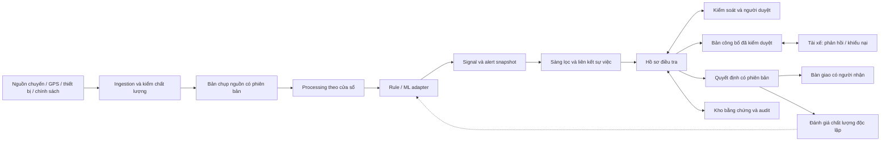

# 01. Tổng quan kiến trúc

Baseline SA 1.0; quy ước và trạng thái tại [README](README.md). Tất cả sơ đồ trong bộ SA biểu diễn thiết kế đích trừ phần ghi rõ hiện trạng.

## Mục tiêu kiến trúc

Xây nền tảng giúp kiểm soát thu thập, tìm kiếm và đối chiếu bằng chứng; tài xế phản hồi các sự việc liên quan đến mình; người độc lập chịu trách nhiệm kết luận và xem xét khiếu nại. Phát hiện tự động giúp tìm và ưu tiên nghi vấn. Giá trị cốt lõi là hồ sơ có căn cứ, xử lý nhanh và truy nguyên được.

Chọn **modular monolith có worker độc lập** cho pilot. Một codebase Python và một PostgreSQL nghiệp vụ giúp giữ giao dịch chặt chẽ; API không chạy công việc batch nặng. Ranh giới module, hợp đồng sự kiện và quyền ghi được xác lập từ đầu để có thể tách riêng ingestion, detection, search hoặc notification khi cần.

## Ba mức trưởng thành

| Mức | Kiến trúc | Điều kiện chuyển tiếp |
| --- | --- | --- |
| P0 — hiện trạng | FastAPI đồng bộ; CLI batch; PostgreSQL 16; frontend Vite chỉ đọc; dữ liệu tổng hợp | Có baseline chức năng, không đủ để mở cho người dùng thật |
| P1 — pilot đích | API + worker + scheduler cùng codebase; PostgreSQL HA, jobs/outbox; object storage; IdP; cổng nội bộ và tài xế; quan sát và backup | Đạt cổng quyền, evidence, workflow, restore và UAT tại tài liệu 13 |
| P2/P3 — mở rộng có điều kiện | Broker quản lý, stream processing, search riêng, analytical store và ML registry; tách các dịch vụ có owner | NFR không đạt sau tối ưu, nhiều consumer cần replay hoặc nhóm có vòng phát hành độc lập; có số đo và ADR |

Mức P1 là sản phẩm hoàn chỉnh theo FR của BA, không phải chỉ thêm hàng đợi vào prototype. Không có yêu cầu tải hiện tại nào bắt buộc viết lại Java hay vận hành Kubernetes. Có thể chọn chúng khi nền tảng doanh nghiệp đã chuẩn hóa và chứng minh được lợi ích tổng chi phí.

## Ranh giới trách nhiệm

- **Nguồn vận hành:** xác nhận chuyến, lịch sử thiết bị, chính sách, dữ liệu payout nếu được tích hợp. Hệ thống điều tra giữ bản đã thu nhận; không sửa nguồn vận hành.
- **Detection:** phát sinh tín hiệu, phép đo, nguồn, chất lượng và đánh giá; không có quyền tạo quyết định cuối.
- **Case workflow:** phân công, bản công bố, tiếp nhận phản hồi, checklist, duyệt, khiếu nại và bàn giao; bảo vệ mọi điều kiện chuyển trạng thái.
- **Evidence:** quản lý bản gốc/bản che, hash, xuất xứ, quyền và vòng đời. Hash chứng minh byte không thay đổi so với bản ghi nhận, không chứng minh sự kiện nguồn là đúng.
- **Quality:** nhãn có thẩm định, đánh giá theo cohort và phiên bản, đưa kết quả trở lại quá trình hiệu chỉnh.

## Những gì tái sử dụng và phải bổ sung

| Quan sát trong code | Quyết định thiết kế |
| --- | --- |
| Bốn rule và taxonomy, `Detector`/`RiskAssessor` protocol | Giữ phép tính và adapter; bổ sung metadata quality, feature contract, governance |
| `load_observations` nạp toàn tập vào bộ nhớ | Thay bằng cửa sổ/chunk và checkpoint; không dùng cho 18 triệu GPS |
| Correlation theo overlap trip/GPS trong một batch | Giữ logic nền; thêm incident registry, liên kết qua batch, xét merge/split có audit |
| Fingerprint chứa signal/rule/model/policy | Giữ fingerprint cho snapshot; tách ID sự việc khỏi fingerprint để tránh sinh hồ sơ mỗi lần đổi policy |
| Một quyết định cuối/case; terminal không mở | Thêm proposal, appeal, decision version và con trỏ hiện hành |
| Reviewer là chuỗi caller gửi; chưa auth | Actor lấy từ IdP/session; RBAC + quyền đối tượng, phân công, trường dữ liệu |
| Evidence FK và JSON trong PostgreSQL | Thu nhận snapshot bất biến và hash từng artifact; không gán lịch sử có sẵn là đã kiểm chứng |
| Nhánh `auto_clear`/`auto_fraud`/`human_review` trong policy | Giữ để đọc lịch sử; P1 dùng policy review, chặn system final decision ở command boundary |

Căn cứ code: [providers](../../backend/app/fraud/providers.py), [observations](../../backend/app/processing/observations.py), [correlation](../../backend/app/fraud/correlation.py), [policy](../../backend/app/decision/policy.py), [case service](../../backend/app/services/cases.py), [entities](../../backend/app/models/entities.py).

## Nguyên tắc từ hệ thống lớn

Tách quản trị rule và thử ở chế độ shadow là bài học có thể áp dụng từ Uber Mastermind. Bài công bố mô tả nền tảng tại thời điểm 2017; không coi đó là sơ đồ nội bộ Uber hiện nay. Thiết kế ở đây dùng rule có cấu trúc và adapter được review. [Uber Mastermind](https://www.uber.com/gb/en/blog/mastermind/).

Stripe Radar công bố risk insights gắn với dấu hiệu giao dịch và điểm rủi ro. Áp dụng cách trình bày căn cứ để điều tra; không mang ngưỡng chặn thanh toán sang kết luận tài xế. [Stripe Risk insights](https://docs.stripe.com/radar/reviews/risk-insights).

SLO theo hành trình người dùng và error budget giúp quyết định ưu tiên độ tin cậy. Bộ SA chuyển nguyên tắc này thành mục tiêu theo BA và phép đo tại tài liệu 10; chưa tuyên bố đã đạt. [Google SRE — Implementing SLOs](https://sre.google/workbook/implementing-slos/).

## Chỉ dẫn triển khai

Quyết định chi tiết và phương án thay thế ở [ADR](12-architecture-decision-records.md). Hợp đồng và sơ đồ đủ để chia backlog; chúng không thay cho migration SQL, OpenAPI hoàn chỉnh hay IaC của đợt implementation. [Lộ trình](13-migration-and-rollout-plan.md) nêu đầu ra và cổng kiểm chứng cho từng đợt.
