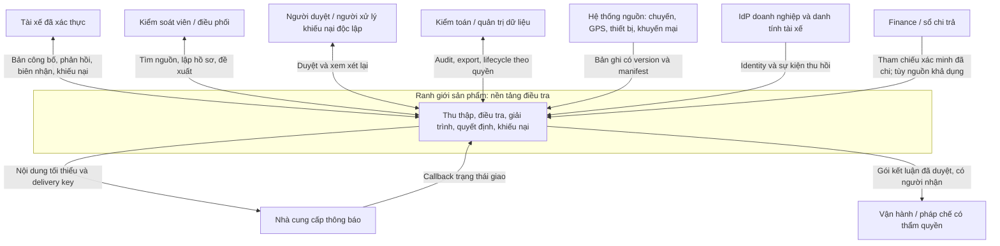

# 03. Ngữ cảnh hệ thống

## C4 — System context đích

Finance là phụ thuộc có điều kiện: khi không có payout, vẫn điều tra được dấu hiệu khuyến mại nhưng không khẳng định tiền đã mất. Mũi tên bàn giao biểu diễn hồ sơ và xác nhận nhận việc; không phải API khóa tài khoản hoặc ghi bút toán.

## Actor và trách nhiệm

| Actor | Quyền theo nghiệp vụ | Không suy diễn từ vai trò |
| --- | --- | --- |
| Tài xế | Hồ sơ đã công bố của mình, phản hồi, nháp, tệp, vấn đề chuyến mình, khiếu nại | Không thấy risk, rule threshold, lời khai người khác hoặc nguồn thô |
| Kiểm soát | Hồ sơ được phân công/phạm vi được cấp; giả thuyết, evidence, đề xuất | Không tự duyệt đề xuất mình hoặc sửa bản gốc |
| Điều phối | Hàng đợi đơn vị và phân công | Quyền phân công không tự cấp quyền xuất dữ liệu |
| Người duyệt | Duyệt/trả lại hồ sơ trong phạm vi, độc lập với điều tra/đề xuất | Chức danh cao không vượt điều kiện độc lập |
| Người xử lý khiếu nại | Xem xét kết luận trước, ghi quyết định tiếp theo | Không là người điều tra/đề xuất/duyệt của vòng bị khiếu nại |
| Risk/Data | Quản trị rule, quality, nguồn, tập đánh giá | Không tự kích hoạt rule do mình tạo; không mặc định xem mọi giải trình |
| Admin/Operations | Tài khoản dịch vụ, cấu hình kỹ thuật, vận hành | Không mặc định đọc hồ sơ nhạy cảm hoặc kết luận thay nghiệp vụ |
| Auditor | Quyền đọc audit và mẫu hồ sơ được cấp; xuất có quyền riêng | Không sửa lịch sử hoặc tiếp nhận nhiệm vụ điều tra từ quyền audit |

Hỗ trợ nhập hộ tài xế cần ủy quyền có phạm vi/hạn và lưu cả người nhập lẫn chủ thể; không đăng nhập giả danh tài xế. Ma trận kỹ thuật tại [08](08-security-and-access-control.md).

## Hợp đồng với hệ thống ngoài

| Tích hợp | Chủ sở hữu nguồn sự thật | Khóa và mức tin cậy | Khi phụ thuộc lỗi |
| --- | --- | --- | --- |
| Chuyến/GPS | Chủ hệ thống vận hành | `org_id + source_system + entity_type + external_id + source_version`; kiểm thời gian/quan hệ | Quarantine, watermark trễ; không kết luận từ dữ liệu không đủ |
| Thiết bị/cấp phát | Chủ nguồn thiết bị | Khoảng hiệu lực và loại quan sát; phân biệt cấp phát với lần nhìn thấy | Hiển thị thiếu bối cảnh, yêu cầu xác minh |
| Chính sách/chi trả | Risk/Finance | Policy version, thời gian hiệu lực; payout ID độc lập với mức thưởng cấu hình | Tiền xác nhận để null nếu chưa chứng từ |
| Identity | Identity owner | Issuer + subject → tài xế/nhân sự; không tự nối theo số điện thoại caller gửi | Login lỗi báo dịch vụ; quyền không kiểm được thì từ chối thao tác bảo vệ |
| Thông báo | Provider + người sở hữu kênh | Callback có chữ ký, provider message ID, trạng thái có ngữ nghĩa được thỏa thuận | Retry có giới hạn, hỗ trợ xác minh giao, chưa khởi chạy hạn tài xế |
| Bàn giao | Đơn vị có thẩm quyền | Decision ID/version, recipient, purpose, receipt | Hồ sơ giữ `handoff_pending`; có thể thu hồi/bổ sung khi quyết định đổi |

Tích hợp ưu tiên adapter pull theo checkpoint/batch manifest cho P1; webhook/CDC khi nguồn hỗ trợ và xác nhận contract. Không đưa DB nguồn vào giao dịch của DB điều tra.

## Vùng tin cậy và luồng dữ liệu cá nhân

1. Trình duyệt và thiết bị tài xế là đầu vào không tin cậy; mọi ID, MIME, timestamp, claim về quyền đều kiểm lại.
2. Edge nhận HTTPS; session tách audience nội bộ/tài xế; API nghiệp vụ kiểm quyền theo object và field.
3. Worker và kho dữ liệu ở mạng riêng; workload identity có quyền tối thiểu từng module.
4. Kênh ngoài ứng dụng chỉ nhận thông báo trung tính và liên kết portal. URL không chứa tên, tọa độ, cáo buộc hoặc bearer token.
5. Dữ liệu phân tích dùng định danh thay thế và tập trường được duyệt; mapping danh tính ở vùng quyền riêng.

Ranh giới một case là một tài xế và một sự việc. Vụ việc liên quan nhiều người dùng liên kết nội bộ giữa các case; publication của mỗi người được tạo riêng. Sự trùng thiết bị chỉ là quan sát để điều tra.

## Chế độ triển khai thay đổi được

P1 mặc định hỗ trợ hợp tác hai bên theo BA. Có thể chạy giai đoạn nội bộ khi portal chưa mở, nhưng chưa được gọi là hoàn thành MVP BA. Nếu tương lai chọn sản phẩm chỉ nội bộ, thay ADR-001 và các FR bị ảnh hưởng; vẫn giữ response/appeal lịch sử và đường xử lý các nghĩa vụ đã phát sinh.

Các dependency chưa xác nhận được quản lý thành cổng ở [13](13-migration-and-rollout-plan.md), không làm giả callback giao, danh tính hay lịch sử phê duyệt để lấp khoảng trống.
