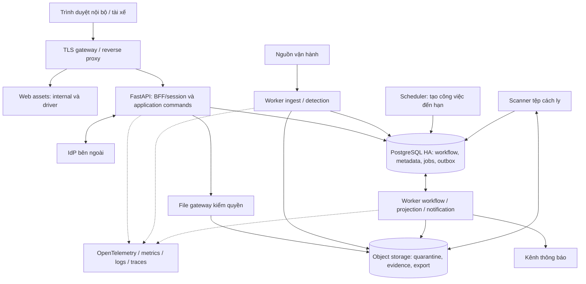
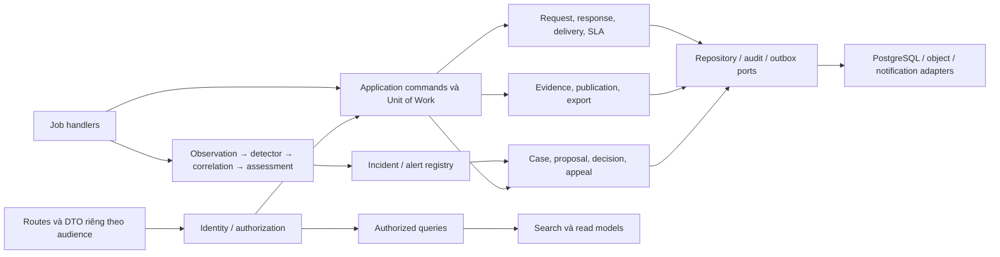

# 04. Container và component

## C4 — Containers của P1

Container ở đây là đơn vị chạy/triển khai theo C4, không bắt buộc mỗi ô là một Docker container hoặc microservice.



API, worker và scheduler dùng cùng release artifact với entrypoint khác nhau. Scanner là tiến trình cách ly, không dùng DB role ghi case. File gateway có thể là module/route của API ở pilot; việc scale riêng không đổi contract quyền tải. Assets có thể phục vụ từ gateway/static hosting cùng origin; không cache dữ liệu hồ sơ tại CDN công khai.

## C4 — Components trong application



Domain rule và state machine không phụ thuộc HTTP, broker hoặc ORM session toàn cục. Application service sở hữu transaction. Adapter có thể đổi mà không thay nghĩa lệnh. Điều này kế thừa các protocol hiện có, bổ sung boundary cho các phần nghiệp vụ mới.

## Module, quyền ghi và giao diện

| Module | Sở hữu ghi | Giao diện chính | Nhóm chịu trách nhiệm |
| --- | --- | --- | --- |
| Identity & Access | Principal binding, role assignment, scope, delegation | `authorize(actor, action, object)` | Security + Backend |
| Ingestion | Batch, source revision, quality, watermark | `accept_batch`, `get_source_revision` | Data |
| Detection | Run, feature snapshot, signal, alert revision | `detect(window)`, `assess(candidate)` | Data/Risk |
| Incident registry | Incident anchors, alert–case links, merge proposals | `link_or_propose_incident` | Backend/Risk |
| Case workflow | Case, owner, proposal, decision version, appeal, handoff | `assign`, `propose`, `approve`, `review_appeal` | Backend/Product |
| Collaboration | Publication request, draft, response version, receipt, delivery/SLA | `publish`, `submit_response`, `record_delivery` | Backend/Product |
| Evidence | Artifact/version, verification, redaction, custody, export | `capture`, `verify`, `publish_projection`, `export` | Backend/Data |
| Search & Reporting | Search document/session, aggregate projection | `search_authorized`, `report_cohort` | Backend/Data |
| Governance | Rule/model release, label version, retention/hold | `activate_version`, `evaluate`, `apply_lifecycle` | Risk/Data |
| Platform | Jobs, inbox/outbox, audit transport, backup inventory | `enqueue`, `relay`, `reconcile` | Operations/Backend |

Các module gọi application contract của chủ sở hữu; không cập nhật bảng module khác bằng SQL tùy tiện. Trong P1, case + response + audit + outbox có thể cùng transaction PostgreSQL qua Unit of Work. Nếu tách service, phải thiết kế lại ranh giới nguyên tử; không giả định transaction phân tán tự xuất hiện.

## Công việc nền và outbox

`jobs` gồm `job_id`, `job_type`, `dedup_key`, `available_at`, `attempt`, `lease_until`, `lease_token`, `state`, `payload_ref`. Scheduler chỉ thêm job có khóa duy nhất, không làm business transition trực tiếp.

Worker claim bằng transaction ngắn `FOR UPDATE SKIP LOCKED`, cập nhật lease rồi nhả transaction. Tính toán/HTTP diễn ra ngoài khóa. Khi commit kết quả phải kiểm `lease_token` vẫn hiện hành, version dữ liệu và unique business key; worker cũ hết lease không được ghi đè worker mới. Heartbeat gia hạn, hết lease được claim lại. `SKIP LOCKED` phù hợp bảng công việc; không dùng nó để đọc hồ sơ cần nhất quán. [PostgreSQL SELECT](https://www.postgresql.org/docs/16/sql-select.html).

Lệnh nghiệp vụ commit cùng audit và `outbox_events`. Dispatcher tạo delivery cho từng consumer, unique `(consumer, event_id)`; việc hoàn tất một consumer không xóa công việc của consumer khác. P1 chuyển outbox thành jobs trong cùng DB transaction. Khi thêm broker, relay publish rồi đánh dấu sau ACK; crash ở giữa có thể gửi trùng. Consumer dùng inbox cùng transaction ghi tác động. Đây là lựa chọn áp dụng nguyên tắc transactional outbox của AWS. [AWS transactional outbox](https://docs.aws.amazon.com/prescriptive-guidance/latest/cloud-design-patterns/transactional-outbox.html).

Không bảo đảm thứ tự toàn cục. Event có aggregate version; consumer projection bỏ qua version cũ, phát hiện khoảng trống và tải bản authoritative hoặc replay phần thiếu. Lệnh không được bỏ qua thứ tự chỉ vì projection có thể tải mới nhất.

## Tách tải và cấu trúc code dự kiến

```text
app/
  api/                 # internal, driver, integrations; DTO và auth
  identity/            # principal, authorization policy
  ingestion/           # contract nguồn, checkpoint, quality
  processing/          # observation window, feature transforms
  fraud/               # detector, assessment, correlation adapters
  decision/            # triage policy; không ghi final decision
  cases/               # workflow, proposal, decision, appeal
  collaboration/       # request, response, delivery, SLA
  evidence/            # artifacts, redaction, publication, export
  search/              # authorized query và projection
  governance/          # rule/model/label/lifecycle
  platform/            # UoW, jobs, inbox/outbox, audit, telemetry
```

Đây là hướng tổ chức, không yêu cầu đổi tên toàn bộ code trước khi thêm chức năng. Di chuyển dần từ `services/*`, giữ adapter tương thích. Worker detection dùng process/CPU riêng; không dùng `BackgroundTasks` trong HTTP làm nơi duy nhất lưu công việc cần bền vững. Export, backfill và training có queue quota thấp hơn tiếp nhận phản hồi và thông báo.

Điểm tách service ưu tiên: detection CPU nặng → notification/search → ingestion nhiều nguồn. Case, proposal, decision và appeal tiếp tục cùng transaction lâu nhất. Java/Spring cho core là lựa chọn thay thế khi năng lực đội ngũ/chuẩn nền tảng chứng minh lợi ích; migration qua contract, không viết lại đồng thời toàn hệ thống.

## Frontend và trải nghiệm trên mạng yếu

Giữ Vite và các module hiện có; mở rộng theo page/controller và API client typed, có thể đưa TypeScript vào phần mới từng bước. Chưa cần đổi framework để hoàn tất P1. Hai entrypoint nội bộ/tài xế có route, DTO và session audience rõ; backend vẫn kiểm mọi quyền độc lập với bundle frontend. Khi độ phức tạp form/state vượt khả năng bảo trì, đánh giá framework bằng ADR thay vì viết lại dashboard đang dùng chỉ để thống nhất công nghệ.

Mỗi trang có trạng thái loading, empty, unavailable, partial/stale và permission-denied phân biệt. Hàng đợi ưu tiên quá hạn → tác động đã xác minh → risk → thời gian tạo → ID ổn định; tác động chưa biết hiển thị unknown và cần đánh giá, không giả là mức thấp. Timeline tách event/received time; khoảng GPS thiếu dùng ký hiệu và bảng dữ liệu thay vì nối thành lộ trình chắc chắn.

Form lưu nháp theo principal/version trên server, hiển thị lần lưu đã xác nhận; debounce không được gọi dữ liệu chưa commit là đã lưu. Khi mất mạng sau gửi, UI tra receipt/retry cùng submission key. Nội dung chữ và trạng thái từng attachment hiển thị riêng; không buộc tải lại tệp đã xác nhận. Khi logout/session hết hạn, xóa state nhạy cảm trong browser; người dùng đăng nhập lại đọc nháp được phép từ server.

Mobile dùng layout thích ứng, label/error gắn input, focus/keyboard, trạng thái không chỉ bằng màu, zoom 200%, bảng thay thế cho bản đồ. Chia nhỏ bundle và lazy-load map/evidence; không tải hàng nghìn GPS khi mở case. Mục tiêu NFR-08 phải thử với 10 người dùng độc lập, ít nhất 8 hoàn thành tác vụ trong 5 phút; automated browser test không thay thử khả dụng này.
