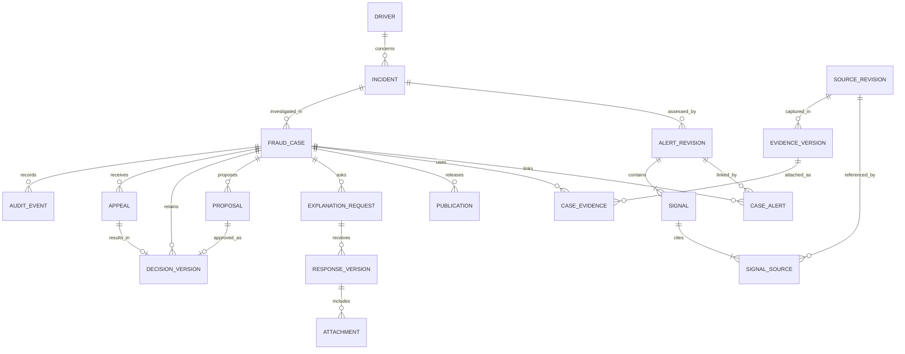

# 05. Kiến trúc dữ liệu

## Phân tầng lưu trữ

| Kho | Dữ liệu | Vai trò và consistency |
| --- | --- | --- |
| PostgreSQL nghiệp vụ | Case, actor binding, proposal, decision, request/response, publication, evidence metadata, audit, jobs | Nguồn sự thật của workflow; transaction ACID; đọc sau ghi từ primary |
| PostgreSQL dữ liệu nguồn | Bản chuẩn hóa, revision registry, GPS partition, feature windows | Sở hữu bởi ingestion; cùng cluster ở P1 nhưng role/schema riêng; có thể tách vật lý sau |
| Object storage | Raw batch, snapshot nguồn, tệp cách ly, evidence, bản che, export, model artifact | Lưu object theo version, checksum, mã hóa; metadata DB chỉ tham chiếu bản đã ghi và kiểm |
| Search projection | Tài liệu chữ/metadata được phép tìm, phiên truy vấn | PostgreSQL ở P1; có thể dựng lại từ nguồn nghiệp vụ; không phải nơi quyết định quyền |
| Analytical store | Cohort, nhãn, thống kê, dữ liệu huấn luyện | Export theo snapshot sau P1; không chạy training lớn trên DB giao dịch |

Không lưu nội dung tệp lớn bằng JSONB hoặc gửi toàn bộ GPS trong một response case. JSONB dùng cho đo lường và cấu hình biến đổi; khóa, trạng thái, tenant, thời gian, version và quan hệ quan trọng là cột có constraint.

## Mô hình quan hệ đích rút gọn

Sơ đồ là mô hình logic, không phải DDL đã có. `EVIDENCE_VERSION` có nguồn từ bản vận hành hoặc từ response/artifact của tài xế; quan hệ source revision là tùy loại. Quyết định khiếu nại có thể không có proposal điều tra ban đầu, nhưng phải có hồ sơ đánh giá khiếu nại riêng. Case có thể được tạo từ báo vấn đề trước khi có alert.

## Định danh, thời gian và version

- Giữ PK bigint hiện có để bảo toàn FK; thêm `public_id` UUID cho API đích. UUID không thay kiểm quyền. ID nguồn nằm trong namespace `org_id/source_system/entity_type/external_id`.
- Source revision duy nhất theo namespace + `source_version`; cùng version mà hash khác phải quarantine `version_conflict`, không upsert ghi đè. Nguồn không có version dùng revision do adapter cấp từ lần thu nhận, giữ hash và đánh dấu độ bảo đảm thấp hơn.
- `event_time` là lúc sự kiện được nguồn khai báo; `received_at` do máy chủ nhận; `effective_from/to` là thời hạn nghiệp vụ; `recorded_at` là lúc ghi revision. Cửa sổ dùng `[start,end)`, lưu UTC, UI hiển thị Asia/Ho_Chi_Minh.
- `case_version` tăng với thay đổi ảnh hưởng workflow. `information_version` tăng khi có evidence/response/đính chính liên quan nội dung. Proposal chụp cả hai cùng danh sách evidence version và checklist.
- `incident_id` là ID ổn định của sự việc; `alert_revision_id` là một lần đánh giá có version. Thay rule/model không tự đổi incident ID. Fingerprint là khóa chống trùng snapshot, không là PK case.
- Tiền dùng decimal cố định kèm currency; `suspected_amount`, `verified_paid_amount`, `confirmed_loss_amount`, `recovered_amount` là trường khác nhau, null khi chưa xác minh. Không dùng float, không cộng nhiều currency vào một tổng.

## Bảng và ràng buộc trọng yếu

| Nhóm | Trường / invariant cần có |
| --- | --- |
| `source_revisions` | ID, namespace/version/hash, schema version, object version, quality, event/received time; unique namespace/version |
| `ingestion_batches` | Manifest/hash, received/valid/duplicate/quarantined counts, checkpoint, completeness; kiểm phương trình đối soát |
| `detection_runs` | Input cutoff, source watermarks, feature/rule/correlation/model/policy versions, mode, counts, errors |
| `signals`, `signal_sources` | Fraud type/category, measurement/unit, threshold, source revision, quality, calculation version; FK nguồn tồn tại |
| `incidents`, `incident_anchors` | Chủ thể, khoảng thời gian, loại anchor, liên kết nguồn, correlation version; unique anchor trong namespace phù hợp |
| `fraud_cases`, `case_alerts` | Org/driver/incident, owner, status, resolution, versions, block reason, current decision ID; một case chủ hoạt động/sự việc theo policy |
| `evidence_versions`, `case_evidence` | Artifact version/hash, nguồn, verifier, verified time, support/refute/unclear, giả thuyết, classification, custody |
| `publications` | Audience/recipient, content version/hash, redaction policy, approver, released/revoked time; không dẫn trực tiếp tới raw object |
| `explanation_requests`, `response_versions` | Publication/request version, SLA/calendar version, delivery proof; response bất biến, receipt ID, server time, late flag |
| `proposals`, `decision_versions` | Căn cứ quy chế, information version, proposer/approver, resolution, reason, supersedes ID; unique `(case_id, decision_version)` |
| `appeals`, `handoffs` | Quyết định bị xem xét, người độc lập, kết quả giữ/sửa/hủy, recipient/receipt và tác vụ khắc phục |
| `audit_events`, `outbox_events` | Event ID, actor, action, object/version, UTC, trace, result; chỉ thêm bằng role ứng dụng |
| `idempotency_records`, `inbox` | Unique `(org, principal, operation, key)` và `(consumer,event_id)`; request hash, result reference |
| `holds`, `lifecycle_jobs` | Phạm vi, authority, purpose, policy version, kỳ hạn, inventory và kết quả xóa/giữ |

FK liên quan tenant phải kiểm cùng `org_id`, dùng composite unique/FK khi thích hợp. Check constraint giữ phạm vi số, thứ tự thời gian, enum và trạng thái hợp lệ. Điều kiện độc lập, ownership và checklist do command handler kiểm trong transaction; DB constraint là lớp phòng vệ bổ sung.

`fraud_cases.current_decision_id` trỏ tới decision thuộc chính case bằng FK ghép; nó là nguồn xác định bản hiện hành. Không duy trì thêm cờ `is_current` có thể lệch. Duyệt/appeal khóa case, thêm bản kế tiếp, cập nhật pointer/resolution, audit/outbox cùng transaction. Decision body chỉ append; thay pointer không sửa nội dung quyết định cũ.

## Evidence và chain of custody

1. Nhận raw bytes vào vùng riêng; tính SHA-256 trên byte thực, lưu kích thước, MIME thật, source ID/version, collector và UTC. JSON chuẩn hóa có version canonicalization; hash raw và hash normalized được phân biệt.
2. Ghi object mới với key không tái sử dụng và object version. Đọc xác minh hash rồi mới commit metadata tham chiếu. Nếu DB thất bại, object mồ côi được reconciliation xử lý sau khoảng chờ; không đưa vào hồ sơ khi chưa có metadata hợp lệ.
3. Quét/kiểm định tùy loại; trạng thái `pending`, `verified`, `rejected`, `unavailable`. Việc source hợp lệ về schema không đồng nghĩa nội dung đã xác minh nghiệp vụ.
4. Bản che/dẫn xuất có object và hash riêng, `derived_from`, công cụ/version, người kiểm duyệt; không thay raw. Timeline custody ghi capture, verification, redaction, attach, export, hold, purge.
5. Manifest evidence dùng khi duyệt đóng băng tập artifact/version/hash và kết quả kiểm. Thay một byte chặn viện dẫn bản đó, mở sự cố integrity; không âm thầm tính hash mới để hợp thức hóa.

Hash ở cùng kho với dữ liệu không chống được quản trị viên đặc quyền sửa cả hai. P1 bổ sung quyền tách biệt và manifest ký bằng khóa KMS, checkpoint audit lưu ở vùng backup độc lập. Object Lock chỉ bật theo lớp dữ liệu và retention đã duyệt; API S3-compatible không tự bảo đảm có cùng tính năng WORM. [Amazon S3 Object Lock](https://docs.aws.amazon.com/AmazonS3/latest/userguide/object-lock.html).

## GPS, partition và chỉ mục

P1 đề xuất range partition GPS theo `event_date` UTC, bắt đầu theo ngày với cửa sổ trực tuyến 30 ngày. Metadata source revision để ngoài partition có unique namespace/version toàn cục; GPS giữ FK tới revision và có key ghép chứa ngày partition. Nhờ vậy, chống trùng không phụ thuộc một unique index không hợp lệ trên bảng partition.

Query GPS bắt buộc driver/trip + khoảng thời gian; index `(org_id, driver_id, event_time, source_revision_id)` và `(org_id, trip_id, event_time)`. Tạo partition trước, cảnh báo default partition/late data, không drop partition chứa dữ liệu đang hold hoặc chưa lưu bằng chứng bắt buộc. Partition pruning và yêu cầu unique chứa partition key phải được kiểm khi viết migration. [PostgreSQL partitioning](https://www.postgresql.org/docs/16/ddl-partitioning.html).

Case index ưu tiên `(org_id, status, due_at, id)`, `(org_id, owner_id, status, id)` và liên kết alert/type; không tạo mọi tổ hợp trước benchmark. Tránh kéo evidence JSON/tệp khi list. PostGIS chỉ bổ sung nếu truy vấn không gian thực tế vượt nhu cầu phép đo rule hiện có.

## Tìm kiếm có quyền và snapshot

P1 dùng PostgreSQL: exact ID bằng B-tree; tài liệu chữ chuẩn hóa Unicode, chữ thường/không dấu theo pipeline có version, `tsvector` cấu hình `simple`, `pg_trgm` cho yêu cầu substring phù hợp. Kiểm riêng tiếng Việt, dấu `đ`, dấu câu và chuỗi ngắn; không giả định cấu hình mặc định hiểu ngữ nghĩa tiếng Việt. [PostgreSQL unaccent](https://www.postgresql.org/docs/16/unaccent.html), [pg_trgm](https://www.postgresql.org/docs/16/pgtrgm.html).

Tài liệu chữ nội bộ và bản đã phát hành cho tài xế có projection khác nhau. Áp quyền trước match/rank/count/snippet; không lọc quyền sau LIMIT. Không đưa toàn bộ GPS thành tài liệu text. Tìm mã nguồn trả metadata và liên kết chi tiết được cấp quyền.

Phiên tìm kiếm materialize danh sách ID + content version + rank theo query/actor/auth epoch tại một transaction snapshot; phân trang theo ordinal ổn định. TTL đề xuất 10 phút, tối đa 10.000 kết quả/phiên; truy vấn vượt giới hạn yêu cầu thu hẹp hoặc export bất đồng bộ, không lặng lẽ cắt và gọi là đầy đủ. Quyền đổi hoặc publication bị thu hồi làm phiên hết hiệu lực; client tìm lại, không tiếp tục dùng tổng số/snippet cũ. Chi tiết mutable mở bản hiện hành, nhãn kết quả ghi thời điểm snapshot. Contract tại [07](07-api-and-integration.md).

## Vòng đời và khôi phục

Retention có policy theo loại dữ liệu/mục đích, không suy 30 ngày online thành ngày purge. Evidence được nhiều case dùng phải tra dependency/hold của tất cả case trước xóa. Đính chính nguồn tạo revision mới và tác vụ xét tác động tới hồ sơ cũ.

Purge có inventory gồm DB, mọi object version, derived/redacted copy, search, export quản lý được, analytical dataset và cache. Xóa chỉ khi hết hạn và không hold; ghi tombstone tối thiểu và biên bản có quyền riêng. Bản đã giao ra ngoài được ghi nhận và gửi yêu cầu xử lý theo quy trình, không tuyên bố thu hồi byte đã tải.

Backup có kỳ hạn riêng, không xóa tức thì từng bản đã backup. Sổ yêu cầu xóa và hold lưu độc lập với lịch backup; restore phải áp lại trước mở truy cập. Khi WORM/hold chưa cho xóa, hạn chế sử dụng và báo trạng thái chờ, không báo xóa thành công. Quy trình phục hồi tại [09](09-deployment-and-infrastructure.md).
