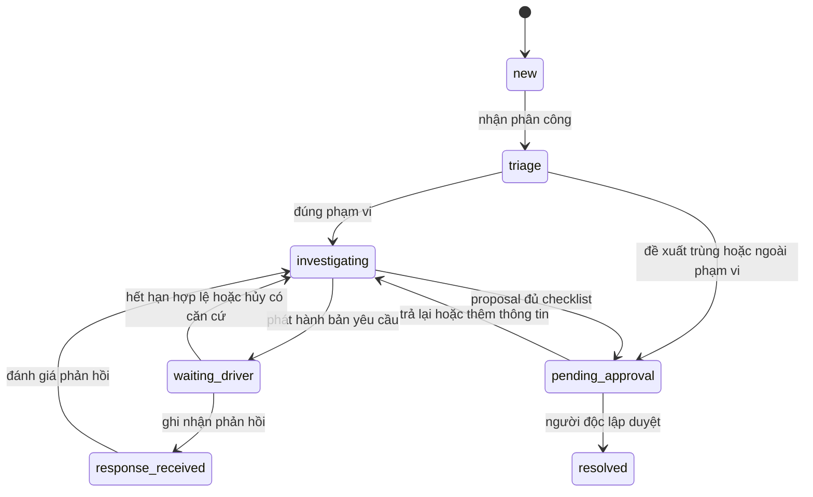
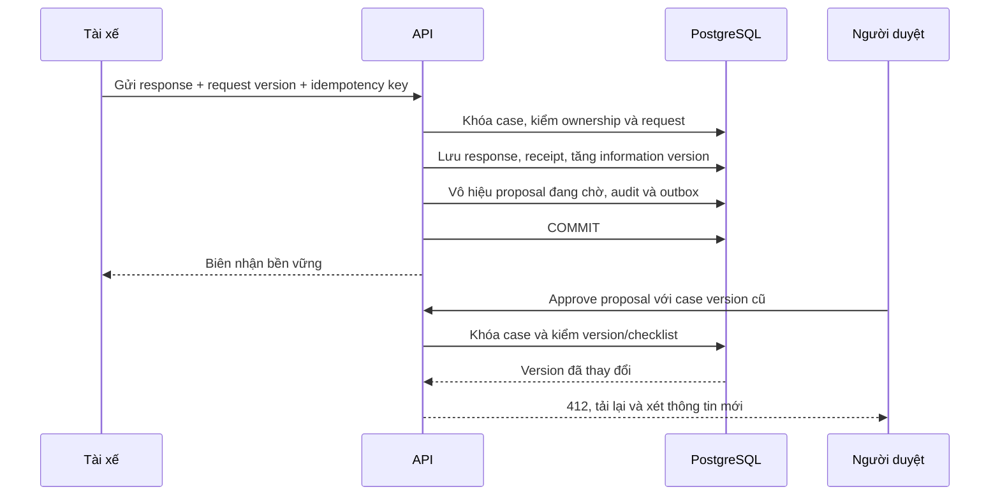

# 06. Pipeline phát hiện và quyết định

## Phân biệt các đầu ra

`Signal` là quan sát có nguồn; `alert revision` là tập dấu hiệu và đánh giá tại một thời điểm; `incident` là sự việc ổn định; `case` là công việc điều tra. `triage outcome` phân luồng; `resolution` là kết luận đã duyệt. Các đối tượng này có vòng đời khác nhau.

Rule hiện tại có GPS spoofing, repeated trips, shared device, promotion abuse. Điểm 0–100 là tổng trọng số mỗi loại một lần và bị chặn trên 100. Probability/confidence của adapter rule đang null, impact unknown. Không đổi thang điểm thành xác suất bằng phép chia 100. [Scoring](../../backend/app/fraud/scoring.py), [providers](../../backend/app/fraud/providers.py).

## Pipeline P1

| Bước | Xử lý và dữ liệu chụp lại | Khi lỗi hoặc thiếu |
| --- | --- | --- |
| 1. Accept | Xác thực nguồn, schema version, batch manifest; ghi nhận/checksum raw, biên nhận sau durable commit | Quarantine bản lỗi; cùng source version khác hash là conflict |
| 2. Normalize | Chuẩn hóa UTC, đơn vị, identity/quan hệ; lưu source revision | Không tự đoán tài xế từ mã gần giống hoặc sửa tọa độ để hợp lệ |
| 3. Build observation | Cửa sổ `[start,end)`, cutoff, source watermark và bộ context cần cho từng rule | `not_evaluable` theo detector với lý do; không coi thiếu dữ liệu là không có dấu hiệu |
| 4. Detect | Rule release bất biến, đo lường, threshold, feature/source refs, coverage | Một detector lỗi không hợp thức hóa kết quả các phần phụ thuộc; báo partial |
| 5. Correlate | Gom nguồn cùng sự việc, chống trùng signal, liên kết incident qua batch | Nhập nhằng tạo tác vụ kiểm tra liên kết; không tự merge case đã phát hành |
| 6. Assess | Risk, probability/confidence nullable, impact, quality/conflict, model/feature version | Model timeout: giữ rule assessment với capability thiếu, không đi tới tự kết luận |
| 7. Triage | Policy `pilot-review-v1`: tạo/cập nhật hàng đợi điều tra hoặc chờ chất lượng/liên kết | Không tạo system final decision trong P1 |
| 8. Persist | Run, alert revision, case link, evidence metadata, audit/outbox trong transaction có giới hạn | Unique key + khóa incident ngắn; retry tái sử dụng snapshot |
| 9. Project | Search/report/notification jobs có consumer inbox | Độ mới được đo; command quan trọng đọc primary |

Không có signal chỉ nghĩa là không phát hiện dấu hiệu trong phạm vi detector/cửa sổ đã chạy. Lưu coverage/run để biết những chủ thể không được đánh giá. Dữ liệu lỗi nghiêm trọng đi hàng đợi chất lượng; không tạo hàng loạt cáo buộc tài xế từ lỗi hạ tầng.

## Cửa sổ, dữ liệu trễ và nguồn đính chính

Chạy micro-batch mỗi 5 phút là tham số khởi điểm; mỗi detector khai báo lookback riêng và feature cần thiết. Rule chuyến lặp hiện dùng cửa sổ 24 giờ; adapter phải đọc đủ lịch sử biên thay vì chỉ 5 phút mới nhất. Device context có khoảng hiệu lực; promotion lấy đúng policy tại event time.

Watermark là mốc hoàn tất đã đối soát của nguồn/partition, không phải timestamp lớn nhất từng nhìn thấy. Có nguồn không đảm bảo completeness thì báo watermark ước lượng và quality thấp. Đề xuất allowed lateness 2 giờ để tổ chức recomputation; không dùng ngưỡng này để vứt dữ liệu. Bản đến muộn hơn hoặc đính chính được lưu, enqueue recompute đúng incident, tạo revision mới và tác vụ đánh giá tác động nếu đã kết luận.

Feature lưu giá trị, đơn vị, `as_of`, cutoff, window, source revision set/hash và transformation version. Huấn luyện dùng dữ liệu biết được tại thời điểm dự đoán, không lấy nhãn/khiếu nại hoặc bản đính chính xuất hiện sau đó làm feature quá khứ.

## Correlation qua batch và version

1. Dedup signal theo canonical measurements, source revision IDs và detector release. Loại tín hiệu khác không bị mất chỉ vì cùng tài xế.
2. Trong observation, dùng overlap trip/GPS theo logic hiện có. Driver/device/promotion chung không đủ để gộp hai sự việc.
3. Tra incident anchors theo org, driver, trip identity hoặc episode nguồn + cửa sổ có phiên bản. Episode nhiều chuyến phải kiểm overlap thời gian và tập chuyến, tránh gộp mọi chuyến của một ngày.
4. Khóa registry của driver/anchor theo thứ tự ổn định, recheck trước insert; unique anchor và snapshot fingerprint giải quyết cạnh tranh. Thay policy/model tạo alert revision mới, liên kết case chủ thay vì tạo case độc lập tự động.
5. Nếu signal nối hai case hoặc cửa sổ trượt tạo ứng viên nhập nhằng, tạo `merge_proposal`. Người kiểm soát xác nhận case chủ/duplicate hoặc giữ riêng; quyết định/evidence/publication cũ không bị xóa. Case đã resolved nhận review task/appeal đặc biệt khi có căn cứ mới.

Không hứa correlation hoàn hảo từ hash. UAT phải có cùng incident đổi rule, hai incident cùng thiết bị, bản đính chính và hai batch cạnh tranh. Hash input chụp `rule_version`, `feature_version`, `correlation_version`, `assessment`, `policy_version`; không dùng thứ tự danh sách ngẫu nhiên hoặc timestamp chạy làm khóa.

## Policy và quản trị thay đổi

P1 tắt cả tự xác nhận lẫn tự bác nghi vấn như kết luận cuối. Các alert đủ dữ liệu vào human triage; có thể gom thông báo/ưu tiên nhưng không âm thầm bỏ mẫu khỏi quality reporting. `auto_clear`/`auto_fraud` của prototype chỉ đọc như kết quả legacy.

Thêm capability server `allow_system_final_decision=false`, kiểm tại command tạo quyết định và DB actor/service permissions, không chỉ ẩn nút UI hoặc tin rằng model luôn trả null. Service detection không được quyền gọi approve. Nếu muốn tự động kết luận về sau phải thay baseline nghiệp vụ, ADR, metric chất lượng, quyền và cơ chế contest/rollback trước bật.

Rule release: `draft → evaluated → approved → scheduled → active → retired`. Người tạo khác người duyệt; mỗi run chụp release đang hiệu lực tại lúc lập kế hoạch chạy. Replay có thể chọn release cũ; run ghi rõ selection mode. Rollback kích hoạt lại release trước cho run mới, không viết lại case/alert cũ. Không cho analyst nhập Python/SQL tùy ý vào runtime.

## Workflow hồ sơ và bằng chứng phản bác

`resolution`: `confirmed_fraud`, `not_fraud`, `inconclusive`, `out_of_scope`, `duplicate`. `block_reason` và các mốc SLA tách khỏi status. Một case resolved có thể có appeal riêng đang xử lý, không đổi terminal lịch sử thành một trạng thái điều tra không rõ nguồn gốc.

Checklist xác nhận gồm quy chế/version áp dụng, evidence đã verified/hash đúng, giả thuyết, thông tin support/refute đã xét, phản hồi từng ý, dữ liệu còn thiếu và tiền xác minh nếu có. Phải có cơ hội phản hồi hợp lệ: yêu cầu được giao rồi có phản hồi hoặc hết hạn đúng policy. Im lặng không thay bằng chứng. Tệp trọng yếu đang quét/lỗi integrity chặn xác nhận.

Phát hành request ghi `waiting_driver` nhưng `due_at=null` cho đến delivery proof hợp lệ. Callback gửi thành công không phải delivered. Callback đầu tiên hợp lệ thiết lập hạn từ delivery; gửi lại không reset. Gia hạn giữ lịch sử hạn cũ/mới, actor và lý do. Bổ sung cáo buộc trọng yếu tạo request/publication version mới và cơ hội phản hồi mới.

## Race phản hồi và phê duyệt

Nếu approve giành khóa và commit trước, response vẫn được tiếp nhận có biên nhận và liên kết luồng khiếu nại/xem xét lại; không bị bỏ vì case đã resolved. Thời điểm máy chủ ghi nhận nội dung và bằng chứng hoàn tất request xác định đúng/trễ hạn; client clock không quyết định. Nếu payload đã đến trước hạn nhưng transaction chờ khóa, lưu server arrival time được tin cậy cùng commit và xét lại tác vụ timeout. Không coi timeout job là sự kiện chứng minh không có phản hồi.

## Khiếu nại và bàn giao

Appeal `submitted → reviewing → decided`, hoặc `rejected` có lý do. Người xử lý độc lập với vòng trước, đánh giá evidence/response version và tạo decision version kế tiếp bằng cùng cơ chế khóa/audit. Giữ nguyên cũng tạo bản mới có căn cứ. Sửa đặt resolution mới; hủy trong SA 1.0 đưa resolution hiện hành về `inconclusive` với `appeal_outcome=annulled` và tác vụ điều tra/xem xét đặc biệt nếu cần. Đây là mapping đề xuất phải chốt ở cổng nghiệp vụ, không xóa nhãn kết luận trước.

Kết quả được công bố bằng projection kiểm duyệt; delivery của kết luận bắt đầu hạn khiếu nại theo policy. Quá hạn vẫn nhận yêu cầu và lý do để sàng lọc xem xét đặc biệt. Decision mới sinh tác vụ đối soát handoff đã gửi, người nhận xác nhận khắc phục; hệ thống không tự sửa ledger hoặc driver status.

## Replay, shadow và kiểm chứng

Replay chạy theo `run_id/mode/input_cutoff/version_set`. Shadow ghi ở schema/namespace riêng, không có credential gửi thông báo hoặc quyền ghi final decision/portal publication; consumer từ chối event shadow trên luồng live. So alert, liên kết incident, lượng case và quality; difference được phân loại trước chuyển cohort.

Kịch bản nghiệm thu: [UAT-01–07, 10–18, 23, 25](../BA/11-acceptance-criteria-and-uat.md), cùng các race tại [13](13-migration-and-rollout-plan.md). ML/anomaly chỉ là adapter tương lai; Uber Risk Entity Watch là tham khảo cho phát hiện bất thường có giải thích và được người đánh giá, không là bằng chứng chất lượng mô hình của dự án. [Uber Risk Entity Watch](https://www.uber.com/us/en/blog/risk-entity-watch/).
