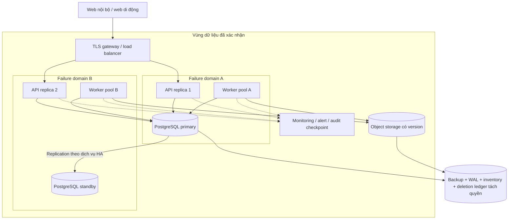

# 09. Triển khai và hạ tầng

## Topology tham chiếu P1

Chọn một vùng triển khai được doanh nghiệp chấp thuận, application trải trên hai failure domain và PostgreSQL quản lý có standby. Object storage, key management và backup phải có khả năng phục hồi độc lập với máy ứng dụng. Cloud/vendor cụ thể còn mở; dùng nền tảng doanh nghiệp hiện có nếu đáp ứng các contract này.

Backup có thể ở vùng khác chỉ khi căn cứ và vị trí dữ liệu cho phép. Hai failure domain trong cùng vùng không giải quyết thảm họa toàn vùng; cold restore tại vị trí đã duyệt là phương án P1. Không hứa RPO=0 từ HA/replication. Phải đo RPO end-to-end gồm DB, object và receipt ledger.

## Môi trường và tài nguyên khởi điểm

| Môi trường | Mục đích | Cấu hình |
| --- | --- | --- |
| Local | Phát triển với dữ liệu tổng hợp | Compose hiện có; bổ sung profile IdP/object/scanner khi làm P1; không dùng credential thật |
| CI | Test/migration/contract, không dùng dữ liệu production | PostgreSQL độc lập, object emulator hoặc integration sandbox, IdP mock cho test và môi trường thật riêng để nghiệm thu auth |
| Staging | Load, quyền, restore, UAT trên dữ liệu được phép | Topology tương tự pilot, thông báo sandbox, report ghi rõ khác biệt tài nguyên |
| Pilot | Người dùng/cohort đã xác nhận | 2 API ×2 vCPU/4 GiB; 2 worker ×4 vCPU/8 GiB; DB tham chiếu 4 vCPU/16 GiB; storage/IOPS theo benchmark |

Các kích thước chỉ là điểm bắt đầu bài đo, không phải sizing được bảo đảm. Scanner có quota riêng; worker workflow có phần tài nguyên được dành trước, không bị detection dùng hết. Đơn vị GiB cho memory/storage nhị phân, GB/TB trong mô hình dung lượng tài liệu 10 là thập phân.

Production dùng image bất biến theo digest, non-root, filesystem tối thiểu, resource limit; không bind mount source như Compose local. Network chỉ mở gateway; DB/object quản trị qua kênh riêng. Kubernetes chưa bắt buộc: managed container runtime hoặc VM/container có orchestration/health/rolling restart đủ cho P1. Nếu tổ chức đã vận hành Kubernetes, dùng chuẩn có sẵn và vẫn giữ nguyên contract.

## Vận hành tiến trình

- API stateless về nội dung nghiệp vụ; session store bền vững nằm DB ở P1. Redis chỉ thêm khi có số đo, không giữ quyết định hoặc lease correctness trong cache.
- Scheduler chạy nhiều replica được nhưng insert job có dedup key, không giả định cron chỉ chạy một lần. Lease/fencing tại [04](04-containers-and-components.md).
- Liveness chỉ kiểm process; readiness kiểm khả năng phục vụ DB/schema phù hợp. Tách trạng thái scanner/provider để lỗi thông báo không làm restart toàn bộ API. `/health` hiện tại chỉ kiểm DB, cần bổ sung endpoint đích trong implementation.
- Graceful shutdown: ngừng nhận request/claim job, hoàn tất transaction ngắn, trả lease hoặc chờ lease expiry. Không kill khi đang giữ transaction dài.
- Pool DB có giới hạn tổng, timeout và backpressure; quan sát connection/wait/lock. Worker bị lỗi không tự chạy lại batch toàn bộ nếu checkpoint đã commit.

## CI/CD và thay đổi schema

Pipeline đề xuất: lint + test hiện có → test PostgreSQL thật/migration → API/event contract → quyền/race trọng yếu → build image/SBOM/scan → staging migration → smoke/UAT liên quan → canary cohort → mở rộng có quan sát.

Schema theo expand–backfill–switch–contract. Migration là job riêng có khóa phát hành và timeout; ứng dụng không tự chạy migration/create_all lúc startup. DDL gây lock hoặc index lớn phải đánh giá kế hoạch riêng; việc chạy `CREATE INDEX CONCURRENTLY` cần migration hỗ trợ chế độ ngoài transaction phù hợp. Không hứa mọi migration rollback bằng `downgrade` an toàn.

Giữ tương thích giữa release hiện hành và release trước trong cửa sổ rollout. Feature flag có owner, expiry, default và audit; tách flags `driver_portal`, `publication`, `notifications_live`, `new_workflow`, `model_shadow`. Capability cấm system final decision là guard phía server, không là flag thuận tiện cho người vận hành bật nhầm.

Rollback application/config dùng artifact trước tương thích schema. Dữ liệu response/decision mới phải tiếp tục đọc và xử lý; không downgrade xóa bảng/cột để quay về giao diện cũ. Nếu client cũ không hiểu workflow mới, đưa cohort vào giao diện bảo trì an toàn và dùng release sửa tương thích.

## Backup, receipt ledger và phục hồi

PostgreSQL: base backup và WAL archiving liên tục để PITR; giám sát cả lần backup thành công lẫn tuổi WAL đã lưu. PITR đòi hỏi chuỗi WAL phù hợp với base backup, không chỉ một file dump. [PostgreSQL continuous archiving](https://www.postgresql.org/docs/16/continuous-archiving.html).

Object: versioning/inventory, backup hoặc replication độc lập theo lớp dữ liệu, key version và checksum. Object chưa có bản copy đáp ứng RPO làm readiness của DR không đạt dù DB backup thành công. Backup/manifest/khóa không được chỉ nằm trong cùng account/quyền quản trị với ứng dụng.

Receipt ledger: sau commit domain, outbox chép receipt ID, command reference, request hash, server time và payload đã mã hóa hoặc artifact reference có khả năng replay sang vùng DR độc lập. Mục tiêu lag nội bộ đề xuất ≤5 phút, cảnh báo trước 15 phút. Việc chép này bất đồng bộ, nên có thể mất phần sau recovery point; UI không được hứa mọi biên nhận đã nhận đều không mất. Server-side ledger, provider/source manifest và receipt client giữ giúp tìm phần thiếu; receipt/hash đơn lẻ không tái tạo được content đã mất.

| Bước restore | Kiểm chứng trước bước tiếp |
| --- | --- |
| 1. Khoanh vùng và ghi incident | Ngừng writers/publisher; giữ queue/checkpoint, xác định mốc dữ liệu và khóa còn tin cậy |
| 2. Khôi phục DB/keys/object | DB PITR tới recovery point đã chọn; có object version được DB tham chiếu, khôi phục key cần thiết |
| 3. Áp deletion/hold ledger mới nhất | Không tái lộ dữ liệu đã bị xóa/thu hồi; mark unavailable khi artifact chưa khôi phục |
| 4. Đối soát receipt/source/provider | Liệt kê before/after recovery point, replay payload còn đủ; thiếu content phải ghi ngoại lệ và quy trình liên hệ |
| 5. Khôi phục search/read models | Rebuild theo version, auth epoch mới; không phục vụ snapshot/export cũ chưa kiểm |
| 6. Kiểm nghiệp vụ | Một decision current/case, hash evidence, actor legacy đúng nhãn, không event thiếu audit, không gửi lại thông báo đã giao |
| 7. Mở theo cohort | Read trước, write sau; kiểm SLA/delivery; ghi RPO/RTO thực đo và ngoại lệ còn lại |

RTO đo từ mất hành trình tới khôi phục sử dụng có kiểm; budget tham chiếu 30 phút phát hiện/khoanh vùng +90 phút DB/object +60 phút reconcile/index tối thiểu +60 phút kiểm/mở. Bài restore phải chứng minh budget với kích thước thật; không đợi rebuild mọi báo cáo phụ nếu hành trình chính đã sẵn sàng và độ trễ được hiển thị.

Diễn tập trước pilot, sau đổi lớn storage/schema và định kỳ đề xuất mỗi quý. Chưa đạt RPO/RTO thì giảm pilot hoặc bổ sung năng lực; không coi bản sao chạy được là nghiệm thu DR. UAT-28 là cổng riêng.

## Runbook tối thiểu trước mở pilot

Runbook phải có owner, tín hiệu kích hoạt, bước thao tác, cách kiểm và rollback cho: DB failover/restore; backlog/outbox stuck; source chậm; scanner lỗi; callback/provider unknown; evidence hash mismatch; thu hồi quyền; purge/hold; rollback rule/model; migration dở dang. Khung xử lý lỗi ở [10](10-performance-scalability-and-reliability.md) và [14](14-technical-risks-and-tradeoffs.md); lệnh cụ thể chỉ chốt sau chọn môi trường.
