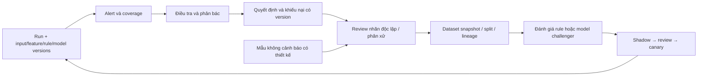

# 11. Quan sát vận hành và phản hồi mô hình

## Hai vòng phản hồi độc lập

Vận hành trả lời hệ thống có nhận, xử lý và giao dữ liệu đúng không. Chất lượng phát hiện trả lời nghi vấn/kết luận có căn cứ và hiệu quả không. API ít lỗi không chứng minh detector chính xác; nhiều cảnh báo không chứng minh giảm tổn thất.

## Instrumentation và dashboard

Dùng OpenTelemetry SDK/collector để truyền trace, metric, log theo chuẩn chung; backend quan sát có thể là dịch vụ hiện có hoặc Prometheus/Grafana và kho log/trace tương đương. Chọn backend sau đo retention/chi phí, tránh gắn domain code vào vendor SDK. [OpenTelemetry signals](https://opentelemetry.io/docs/concepts/signals/).

| Dashboard | Chỉ số tối thiểu | Owner và hành động |
| --- | --- | --- |
| Hành trình người dùng | Availability, latency p95/p99, lỗi gửi/duyệt, auth denied, mobile errors | Operations/Frontend; phân biệt lỗi nghiệp vụ và lỗi hệ thống |
| Nguồn dữ liệu | Accepted/duplicate/quarantine counts, watermark age, missingness, version conflict, correction rate | Data; tìm nguồn im lặng và batch không cân bằng |
| Pipeline | Run duration, coverage/not_evaluable, detector timeout, late-event lag, alert/case/incident ratio | Data/Risk; ngăn rule lỗi sinh hàng loạt case |
| Hàng đợi | Oldest job age, attempts, lease expiry, outbox consumer lag, DLQ age | Operations; xử lý backlog theo consumer/type |
| Điều tra | New/backlog/overdue, owner capacity, block reasons, thời gian thao tác/chờ/duyệt | Risk/Operations; điều chỉnh phân công có audit |
| Hợp tác | Sent/delivered/read riêng, failed/unknown delivery, receipt success, scan pending, SLA | Product/Operations; không tính sent là delivered |
| Integrity/security | Hash mismatch, audit gaps, unauthorized scope attempts, revocation lag, export anomalies | Security/Audit; mở sự cố theo mức độ |
| DR/lifecycle | WAL/object/receipt-copy lag, restore age, orphan objects, hold/purge reconciliation | Operations/Data; chặn purge/rollout khi chưa kiểm |
| Chất lượng | Precision, unknown rate, adjudication disagreement, appeal reversal, sample coverage | Risk/Data; đánh giá theo version/cohort |

Trace nối `request_id`, `job_id`, `event_id`, `run_id`, `case_public_id` trong kho có quyền; không đưa driver/case ID vào metric label gây cardinality cao. Metric labels giữ route template, job type, detector release được giới hạn, outcome, environment. Không log token, query text nhạy cảm, giải trình đầy đủ, tọa độ hoặc object URL ký sẵn.

Audit và telemetry có retention/quyền khác nhau. Audit quyết định không sampling; trace kỹ thuật có thể sampling theo error/latency và quota, không được dùng trace thiếu mẫu để kết luận đủ audit. Collector lỗi phải có dropped-event metric và buffer hữu hạn.

## KPI có mẫu số và thời điểm chốt

| KPI | Định nghĩa | Giới hạn diễn giải |
| --- | --- | --- |
| Precision trên mẫu có nhãn | TP / (TP + FP), với TP/FP do nhãn độc lập xác định | Mẫu hàng đợi thuận tiện không đại diện toàn bộ tài xế |
| Recall ước lượng | TP / (TP + FN), cần tìm FN từ mẫu không cảnh báo và trọng số lấy mẫu | Không tính được từ chỉ case/alert; thiếu mẫu thì báo unavailable |
| False positive rate | FP / (FP + TN) trên cohort/sampling xác định | Không gọi `1 - precision` là FPR |
| Unknown rate | Chưa xác định / toàn bộ đơn vị trong cohort; báo riêng pending/inconclusive/appeal/legacy | Không loại khỏi màn hình để làm đẹp precision |
| Appeal reversal | Số appeal đã quyết định làm thay đổi/hủy kết luận / số appeal đã quyết định trong cohort | Thiên lệch tự chọn người khiếu nại; không là FPR toàn nền tảng |
| Automation rate | Số quyết định cuối tự động / số quyết định cuối trong cohort | Bằng 0 cho P1 theo policy; tự động tạo signal không tính vào đây |
| Confirmed loss / recovered | Tổng tiền có chứng từ xác minh theo currency và tránh case duplicate | Giá trị thưởng cấu hình/case count không là tiền đã mất/thu hồi |

Mọi biểu đồ cần `cohort_id`, đơn vị đếm (trip/incident/case/driver), time range, cutoff, label version, số bị loại, watermark và khoảng bất định phù hợp. So sánh cùng đơn vị, policy và độ trưởng thành nhãn; không đếm cùng incident nhiều lần sau đổi rule.

Ví dụ UAT-22: TP=30, FP=10, inconclusive=5, pending=5 → precision 30/40=75%, đồng thời hiển thị 10/50 chưa đủ nhãn; 2/10 appeal đã giải quyết bị đảo →20%. Chưa có FN/TN nên không tính recall hoặc FPR. [UAT BA](../BA/11-acceptance-criteria-and-uat.md).

## Quản trị nhãn và tập dữ liệu

1. Lưu decision version làm nguồn tham khảo, không tự biến mọi `confirmed_fraud` thành nhãn vàng. System decision legacy, dismissed chưa phân loại, inconclusive và đang appeal cần trạng thái riêng.
2. Chọn mẫu có thiết kế theo loại nghi vấn/nguồn/thời gian/vùng/cohort và mẫu không cảnh báo; giữ xác suất lấy mẫu nếu dùng để ước lượng toàn quần thể. Tránh chọn chỉ case dễ xác nhận.
3. Người review nhãn độc lập kiểm căn cứ và phản bác; mẫu bất đồng có adjudicator. Lưu guideline version, annotator, disagreement, confidence về nhãn và lý do.
4. Khi appeal/đính chính thay kết luận, tạo label version mới, đánh dấu dataset/model chịu ảnh hưởng; không âm thầm đổi tập đánh giá đã công bố.
5. Tách dữ liệu tổng hợp khỏi thật. Split theo thời gian, giữ cùng incident và các entity liên hệ trong cùng split khi có nguy cơ leakage; kiểm driver/device overlap. Feature dùng dữ liệu biết được tại prediction cutoff.
6. Dataset manifest gồm danh sách source/label/feature versions, split seed/policy, hash, quyền sử dụng và retention/hold; danh tính trực tiếp không vào artifact nếu không cần.

P1 có quy trình nhãn/đánh giá rule theo FR-21 dù chưa triển khai model thật. Cỡ mẫu/chấp nhận precision phụ thuộc baseline, prevalence và chi phí lỗi đã chốt với Risk; không đặt mục tiêu 95% từ fixture tổng hợp.

## Vòng đời mô hình sau pilot

Registry lưu artifact/hash, feature schema/transform versions, dataset/label manifest, code/image version, hyperparameters, evaluation/calibration report, owner, serving contract và rollback target. Lifecycle `registered → evaluated → approved → shadow → canary → active → retired`; reviewer release độc lập với người tạo.

Điểm tham khảo từ Michelangelo là quản lý vòng đời dữ liệu–huấn luyện–đánh giá–serving–monitoring và tái sử dụng biến đổi feature. Áp dụng bằng contract/manifest trước khi đầu tư feature store tập trung. Bài công bố năm 2017 không phải yêu cầu sao chép toàn stack của Uber. [Uber Michelangelo](https://www.uber.com/us/en/blog/michelangelo-machine-learning-platform/).

Model dùng để ưu tiên phải chứng minh hiệu quả so với rule baseline ở cùng tải review, phân tích calibration nếu xuất probability, feature missingness và các nhóm đủ mẫu. Anomaly score biểu diễn độ bất thường, không tự là probability. Trường `confidence` chỉ có giá trị khi model contract nêu nghĩa/cách kiểm; không dùng generic confidence để mở quyền quyết định.

Theo dõi data drift, score drift, missingness, calibration và hiệu quả trên nhãn đã trưởng thành. Ngưỡng cảnh báo theo baseline/cohort đã duyệt, chưa chốt PSI/KS tùy ý. Drift kích hoạt điều tra hoặc quay về adapter đã kiểm; không tự retrain rồi kích hoạt. Canary so latency, quality, error/coverage và case load; kill switch trả về rule review, giữ mọi prediction snapshot.

## AI hỗ trợ điều tra tùy chọn

OCR/tìm ngữ nghĩa/LLM có thể giúp dẫn trang, tóm tắt câu hỏi hoặc tìm nội dung mâu thuẫn sau P1. Output là bản nháp có source/page/version; người kiểm soát xác nhận trước dùng. Không suy dữ liệu bị thiếu, không điều khiển command từ nội dung tệp, không mở rộng quyền retrieval, không dùng văn bản AI làm bằng chứng gốc. Mọi khả năng này cần đánh giá riêng tại ADR-012.
