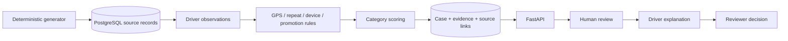
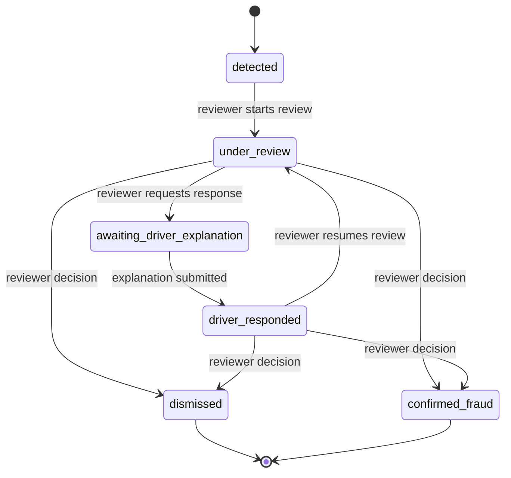

# Architecture

The milestone is one synchronous FastAPI application and one PostgreSQL database. The same Python
domain modules are called by a batch detection CLI and by tests. Routes delegate investigation
operations to services; detectors contain no SQL or HTTP behavior.

## Module responsibilities

| Location | Responsibility |
| --- | --- |
| `app/core` | Validated environment settings, domain enums, structured logs |
| `app/db` | SQLAlchemy base, UTC timestamp type, session lifecycle |
| `app/models` | Relational entities, indexes, foreign keys, check constraints |
| `app/fraud/types.py` | Typed observations, immutable signal envelopes, source references |
| `app/fraud/*_detector.py` | Pure, deterministic, measurable detection rules |
| `app/fraud/scoring.py` | One weight per category, cap at 100, primary category |
| `app/fraud/engine.py` | Load observations, aggregate signals, persist case/evidence snapshots |
| `app/services` | Review workflow, original-source retrieval, synthetic generation/import |
| `app/schemas` and `app/api` | Input/output contracts and thin HTTP handlers |
| `alembic` | Versioned schema creation and rollback |
| `scripts` | Batch generation and fraud detection entry points |

## Evidence and scoring

A detector returns structured `Signal` objects containing category, rule name, severity, explanation,
primary source type/id, numeric details, and a list of every source required to verify the result.
The scoring service uses configured category weights; detectors do not embed score constants.

A driver's signals form one aggregate case. Its primary category is the highest weighted category;
ties use alphabetical category order. All categories remain available in `fraud_types` and the
score breakdown. Evidence items retain category weights individually; duplicate signals in a
category do not increase its contribution. Severity describes the signal, not a guilt finding.

Case evidence is a snapshot. Original records are reachable through typed foreign keys and a source
inspection API. Device association timestamps are also copied into evidence to preserve the observed
relationship if its live first/last-seen values later change. The API provides no raw-data mutation
or deletion routes. Database administrators can still change data; cryptographic evidence signing
and tamper-proof storage are outside this milestone.

## Transactions and reruns

The CLI owns a transaction for each batch. Failed imports and detection writes roll back together.
The engine reads the milestone dataset using a small number of queries and holds it in memory.
It is intended for approximately 5,000 trips, not unbounded historical ingestion.

Before persisting signals, the engine locks the driver's row. A SHA-256 fingerprint over driver ID,
canonical signal details, source references, and the complete rule settings has a database unique
constraint. Concurrent identical PostgreSQL runs serialize per driver and reuse the same case.
Changing configuration or detected evidence can create a new immutable case snapshot, including
when a previous snapshot was dismissed. This never reopens the old case. Consolidation of new
evidence into active cases is a later product decision.

Review services lock the case row before validating its current status. State change, audit event,
explanation, and/or decision are committed in the same request transaction. A unique decision
constraint and row locking prevent two competing final decisions from both succeeding.

## Human workflow

After requesting an explanation, a response is required to proceed. No expiry, override, appeal,
or reopening mechanism exists yet. Every reviewer action requires a nonblank reviewer name and
reason. Automated detection neither creates `case_decisions` nor updates driver status.

## Operating assumptions and extension points

All stored timestamps are aware UTC values; naive writes are rejected. GPS IDs represent ingestion
sequence for a trip in this milestone. Promotion validity is evaluated using source timestamps,
so a batch can investigate historical synthetic records consistently.

The API is for trusted local development and does not authenticate submitted identities. Add
authentication and role/driver ownership checks before exposing it to multiple parties. Future
ingestion should validate source payloads and preserve ingestion ordering; future incremental
detection should define an explicit observation window and case-update policy. These needs do
not require services or brokers now.

Implementation uses the typed ORM approach described in the
[SQLAlchemy 2 documentation](https://docs.sqlalchemy.org/en/20/orm/quickstart.html),
[Pydantic settings](https://docs.pydantic.dev/latest/concepts/pydantic_settings/), and
[FastAPI testing tools](https://fastapi.tiangolo.com/tutorial/testing/).
