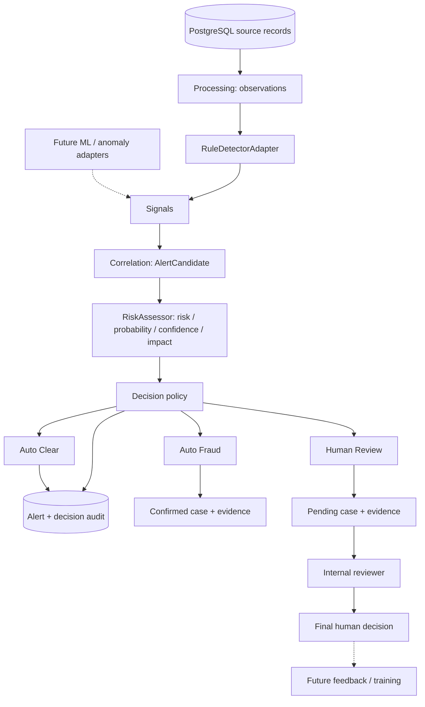
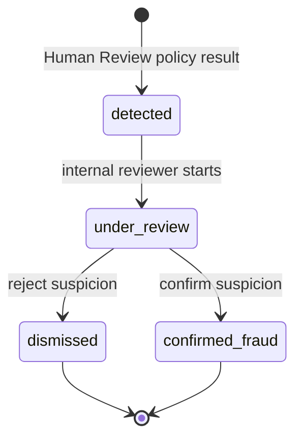

# Transitional architecture

This implementation follows the priorities in [architect-review-comparison](architect-review-comparison)
and establishes the first stage of [new_architecture](new_architecture.md): a FastAPI modular
monolith with separate detection, correlation, decision policy and case management boundaries.
PostgreSQL remains the application database. Detection runs synchronously through the batch CLI.

## Scope and module boundaries

| Module | Implemented responsibility |
| --- | --- |
| `app/processing/observations.py` | Existing bounded batch loading into driver observations |
| `app/fraud/providers.py` | `Detector` and `RiskAssessor` protocols; existing rules behind adapters |
| `app/fraud/*_detector.py` | Existing pure deterministic rules; no SQL/HTTP or policy decisions |
| `app/fraud/contracts.py` | Typed `AlertCandidate` and independent `Assessment` fields |
| `app/fraud/correlation.py` | Deterministic grouping into related incidents and canonical fingerprints |
| `app/fraud/scoring.py` | Existing rule weights, counted once per fraud type, capped at 100 |
| `app/decision/policy.py` | Pure business routing into Auto Clear / Auto Fraud / Human Review |
| `app/services/detection.py` | Transactional alert, policy result and optional case/evidence writes |
| `app/fraud/engine.py` | Wire processing, detector, correlation, assessor and persistence together |
| `app/services/cases.py` | Internal review queue, transitions, final human decisions and audit |
| `app/services/alerts.py` | Read detection snapshots, including alerts without a case |
| `app/services/sources.py` | Existing evidence-to-original-record retrieval |
| `app/models`, `app/db`, `alembic` | PostgreSQL persistence and versioned schema |
| `app/api`, `app/schemas` | Thin routes and API contracts |

`run_detection` accepts replaceable detector and assessor implementations. A future ensemble can
combine rules, ML and anomaly output behind those interfaces; a future worker can call the same
pipeline with its own database transaction. No model prediction is accepted from an unauthenticated
HTTP endpoint.

## Signal, alert and case

A `Signal` remains a domain object carrying the fraud type, rule/signal name, severity, numeric
measurements and original source references. Its category comes from the explicit taxonomy:

| Category | Existing fraud type |
| --- | --- |
| `location_fraud` | `gps_spoofing` |
| `trip_fraud` | `repeated_trips` |
| `account_fraud` | `shared_device` |
| `incentive_fraud` | `promotion_abuse` |

The initial correlation groups signals connected by common trip/GPS references within one driver
observation. Connected groups may contain several fraud types. Unrelated trips become separate
alerts even for the same driver. Shared driver, device or promotion identity alone does not merge
incidents. Exact duplicate signals are ignored. This is a source-based scaffold, not learned
correlation: temporal windows, incident discovery across batches and case merging remain future work.

Each correlated alert is persisted with its signal snapshots, assessment, rule configuration and
policy result. Auto Clear keeps that audit record without a case. Auto Fraud creates a terminal
`confirmed_fraud` case with evidence and a system decision. Human Review creates a pending
`detected` case; this existing status name represents the exception queue. No signals means no alert.

Evidence for cases retains the existing typed foreign keys and source inspection APIs. Alert-only
signal snapshots contain source descriptors and measurements in JSON; they do not introduce a new
relational source-retention table. Source-retention requirements for cleared alerts are a later
storage design task.

## Decision policy

`risk_score` (0–100), `fraud_probability` (0–1), `confidence` (0–1), impact and model version are
separate fields. The existing rule weights provide only risk; probability and confidence remain
null and impact remains `unknown`. They are not estimated by dividing the rule score by 100.
Consequently current rule-only detections route to Human Review. The framework supports automatic
routing when an assessor supplies the required estimates and impact context.

The example versioned policy evaluates these conditions in order:

1. High, critical or unknown impact, conflicting signals, missing probability/confidence or low
   confidence require review.
2. With low impact and confidence at least 0.90, probability at most 0.10 and risk at most 20 clear
   the alert automatically.
3. With low impact and sufficient confidence, probability at least 0.95 produces Auto Fraud.
4. Remaining results require review.

Thresholds are validated through `DECISION_POLICY`; they are scaffold defaults requiring later
calibration. The policy reads model output; it does not train a model or execute driver sanctions.
`score_breakdown` continues to describe rule contributions, which need not sum to a future model's
risk score. Both automatic and human conclusions change the case only; driver status is unchanged.

## Review and historical compatibility

Drivers are data subjects, not application users. The explanation write endpoints and services
have been removed. Historical explanation rows remain readable in case details. Old cases in
`awaiting_driver_explanation` or `driver_responded` can enter `under_review` through the existing
review endpoint, without a driver response. The old enum values are retained for history; the new
workflow never enters them. Terminal cases cannot be reopened. Human decisions remain available
as the foundation for a later feedback export; training and override/appeal workflows are deferred.

`GET /review-queue` lists unresolved cases ordered by risk then ID. `GET /fraud-alerts` can filter
by policy outcome and driver. Case details include the linked alert and policy decision, while
legacy cases have a null alert link.

## Transactions, upgrades and retries

The caller owns the batch transaction. Per-driver PostgreSQL row locks and a unique fingerprint
serialize concurrent detection. The fingerprint includes correlated signals, rule configuration,
assessment/model version and the complete decision policy. Repeating an identical run reuses both
alert and case, including a prior clear result with no case. Summary outcome counters count newly
persisted decisions only. New evidence or changed policy/model settings create a new snapshot;
old decisions are not reopened or overwritten.

Migration `0002_alert_decisions` adds `fraud_alerts`, `decision_results`, nullable unique
`fraud_cases.alert_id` and `case_decisions.actor_type` (historical default `human`). Existing cases,
evidence, explanations and decisions remain intact. Historical cases are not backfilled with
invented alerts or model estimates; a new detection run may create new snapshots alongside them.
Run `alembic -c backend/alembic.ini upgrade head` before restarting the updated application.

Review operations continue to lock each case before checking its status. State changes, audit
and the unique final decision share a transaction. Source writes reject naive timestamps and use
UTC. The observation loader still holds the small demonstration dataset in memory (about 5,000
trips); this scaffold makes no streaming or production-scale claim.

## Subsequent stages

| Area | Extension after this scaffold |
| --- | --- |
| Ingestion | Event contracts, validation, deduplication and explicit observation windows |
| Workers / messaging | Queue adapter, worker entry point, retries, outbox, idempotent event consumption; Redis/RabbitMQ when needed |
| ML / anomaly / ensemble | Real model inference, feature engineering, calibrated estimates, model registry |
| Storage | Redis cache and object storage for larger evidence/model artifacts |
| Feedback / monitoring | Human-label export, quality/drift metrics, model retraining and operational dashboards |
| Business API | Authenticated internal roles, assignments, richer queue filters, controlled overrides and actions |

No broker, Redis, object storage service, background worker, frontend or ML model is deployed by
this change. Kafka, Kubernetes, Java and a microservice split remain future options. Existing
FastAPI/PostgreSQL operation and dependencies are sufficient for the implemented stage.
