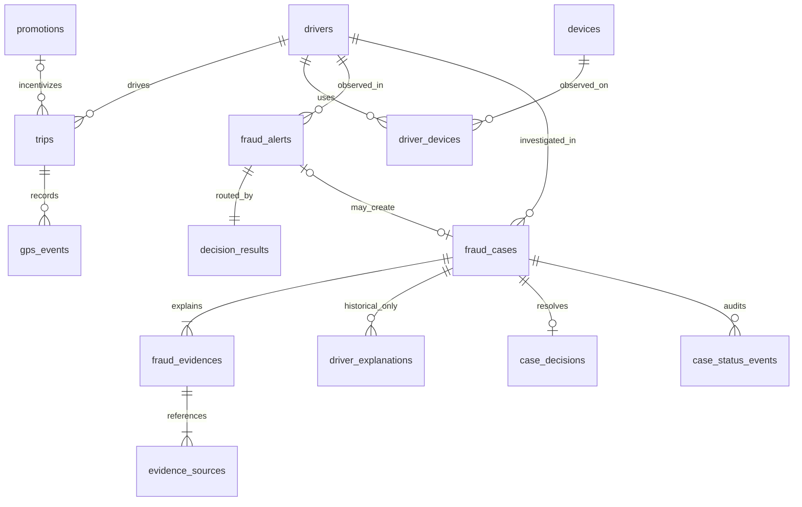

# Data model

The initial migration creates twelve application tables; `0002_alert_decisions` adds two tables
and extends cases and final decisions without deleting historical data. Integer IDs are database keys; external
driver IDs and device identifiers are separately unique. PostgreSQL is authoritative; the JSON
fallback and UTC restoration in SQLite exist for lightweight tests only.

## Source tables

| Table | Main fields and constraints |
| --- | --- |
| `drivers` | `id`, unique `external_driver_id`, `name`, `status`, creation/update times |
| `trips` | Driver FK; pickup/drop-off coordinates; start/end; distance; decimal fare/promotion amounts; optional promotion FK; creation time |
| `gps_events` | Driver FK and composite `(trip_id, driver_id)` FK to trips; coordinates; recorded time |
| `devices` | `id`, unique `device_identifier`, creation time |
| `driver_devices` | Composite PK `(driver_id, device_id)`, first/last observed use |
| `promotions` | Unique code, validity start/end, positive trip threshold, nonnegative decimal reward, creation time |

Trip durations must be positive, distances and monetary amounts nonnegative, and coordinates
within geographic bounds. Composite GPS/trip ownership prevents attaching one driver's point to
another driver's trip. GPS timestamps themselves are allowed to be inconsistent: detecting that
source anomaly is part of the domain. Association last-seen times cannot precede first-seen times.

GPS timestamps need not fall within the trip duration at the database level; ingestion validation
and a separate trip-time consistency rule may be added later. The initial GPS rules compare points
within their own trip and do not enforce trip boundaries beyond the foreign key.

## Investigation tables

| Table | Purpose and retained fields |
| --- | --- |
| `fraud_alerts` | Driver FK, correlation key, unique detection fingerprint, primary/all fraud types, severity, risk, nullable probability/confidence, impact, model version, assessment/rule/signal snapshots, creation time |
| `decision_results` | Unique alert FK, outcome (`auto_clear`, `auto_fraud`, `human_review`), reason, policy version/configuration, creation time |
| `fraud_cases` | Nullable unique alert FK (null for legacy cases), driver, primary fraud type, all types (JSONB), score 0–100, category contributions (JSONB), rule settings (JSONB), unique detection fingerprint, status, creation/update times |
| `fraud_evidences` | Case FK, category, rule name, primary source type/id, severity, category weight, description, measurable `evidence_data` JSONB, creation time |
| `evidence_sources` | Evidence FK, source type/id, exactly one typed source FK |
| `driver_explanations` | Deprecated, read-only history: case FK, explanation text, attachment metadata JSONB (empty until uploads exist), creation time |
| `case_decisions` | Unique case FK, terminal decision, actor type (`human`/`system`), reviewer/actor identifier, reason, creation time |
| `case_status_events` | Case FK, previous/new status, actor, reason, creation time |

The primary evidence `source_type`/`source_id` is a convenient descriptor. The engine also inserts
it into `evidence_sources`, where it is backed by a real FK. Each source row has exactly one of
`driver_id`, `trip_id`, `gps_event_id`, `device_id`, or `promotion_id`. Database checks require that
the populated FK matches both the descriptor's type and ID. Unique `(evidence_id, source_type,
source_id)` prevents duplicate references. Database FKs prevent deletion of referenced originals.

Every case created by the engine has at least one evidence item, and every evidence item has at
least its primary source link. These minimum counts are transactional service invariants, not
cross-table count checks. There is no cascading raw-source deletion or automatic evidence cleanup.

`case_decisions.decision` is restricted to `dismissed` or `confirmed_fraud`. A case can have only
one final decision. State transitions are validated by the review service under a row lock;
the audit event and final decision share the same transaction. Automatic case conclusions also
create a final decision with `actor_type=system`. Historical final decisions default to `human`.

An alert always has one policy result in the transactional service. A clear result has no case;
review and fraud results each create one case. These routing invariants are enforced by the
service, while unique constraints prevent duplicate decisions/cases for an alert. Risk is 0–100;
probability/confidence are independently nullable values constrained to 0–1. Signal snapshots
stay inside `fraud_alerts.signals`; separate signal/model/training tables are deferred.

`fraud_category` is derived from `FRAUD_TAXONOMY`, mapping existing fraud types to parent categories.
It is exposed on signals, alerts and cases without rewriting historical fraud type values.

Migration does not fabricate alerts for old cases or change their states. Old explanation states
remain valid historical values; only internal review can resume them. Re-running detection after
upgrade can create new snapshots alongside those legacy cases. Downgrading revision 0002 removes
the new alert/policy audit tables and fields; use a disposable database for rollback checks.

## Enum and timestamp choices

Domain enums are Python string enums stored as VARCHAR with named check constraints, using
`native_enum=False`. Adding a value requires updating the Python enum, API/workflow as appropriate,
and an explicit Alembic migration for check constraints and column width. This avoids reliance on
PostgreSQL native enum alteration, but does not eliminate migrations.

All times use `TIMESTAMP WITH TIME ZONE` on PostgreSQL. The application rejects naive datetimes
and normalizes aware datetimes to UTC; API times include their timezone. Source dataset timestamps
are fixed for reproducibility. Case creation and review times are actual application UTC times.
Money uses `NUMERIC(12,2)`; evidence renders money as decimal strings to avoid precision loss.

## Indexes

- Alerts by driver and correlation key; policy results by outcome; unique case/decision alert links.
- Unique external driver IDs, device identifiers, promotion codes, detection fingerprints, and case decisions.
- Trips by `(driver_id, started_at)` and promotion ID.
- GPS by `(trip_id, recorded_at)` and `(driver_id, recorded_at)`.
- Device membership by device ID as well as the driver-first composite primary key.
- Cases by driver, primary category, and `(status, risk_score)`.
- Evidence by case and category; source rows by evidence and each typed source FK.
- Explanations and status events by case.

Case category filtering uses an evidence `EXISTS` query so secondary categories match without
requiring a JSONB-specific query or GIN index. These indexes support the milestone's actual access
paths; analytics indexes should be based on measured future workloads.
